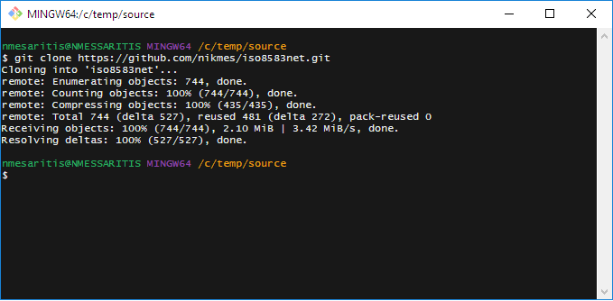
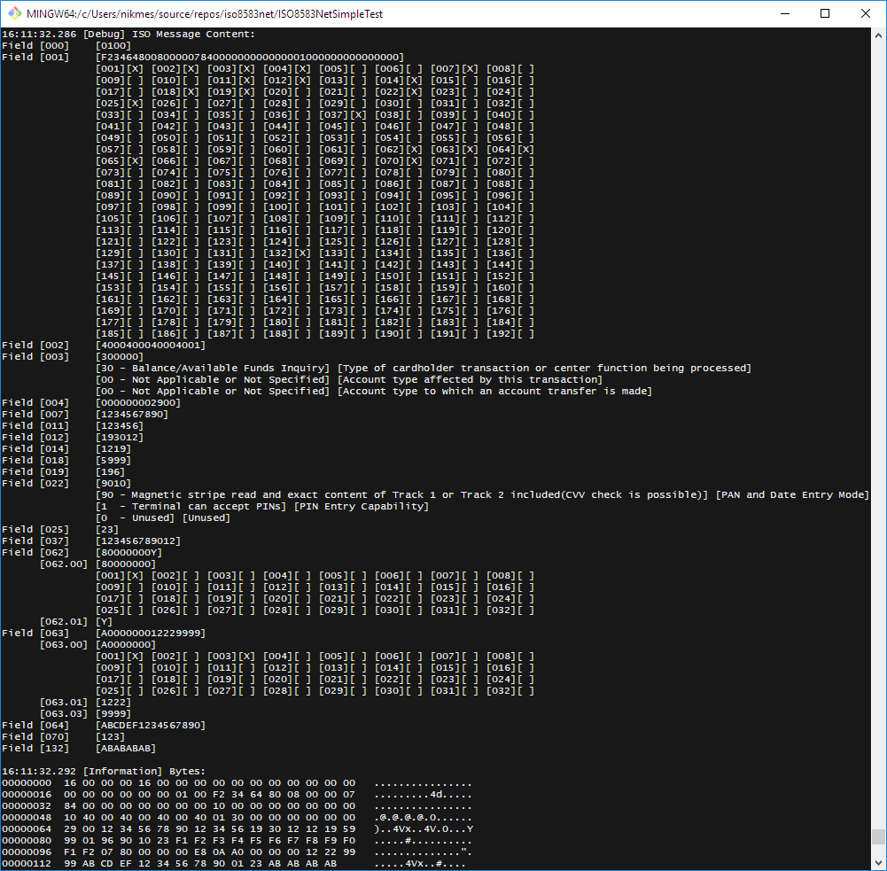
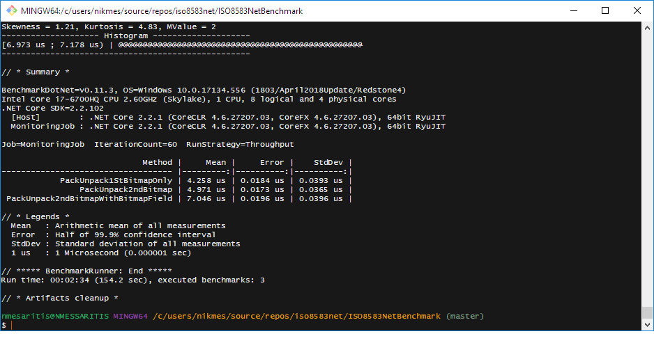
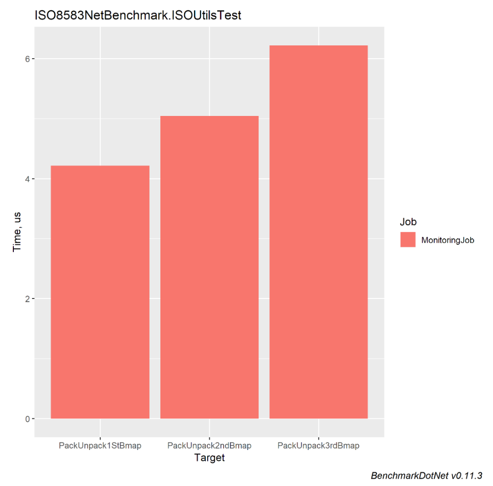

# ISO8583Net

[](https://dotnet.microsoft.com/)
[](https://www.nuget.org/packages/ISO8583Net/)
[](LICENSE)

A highly configurable .NET library for building and parsing **ISO 8583** financial transaction messages. ISO 8583 dialects are defined using **JSON configuration files** — no code changes needed to switch between different financial network specifications.

> **Version 2.0.0** — migrated from XML to JSON dialect definitions with System.Text.Json polymorphic deserialization.

📖 **Documentation Site:** [nikmes.github.io/iso8583net](https://nikmes.github.io/iso8583net/)

---

## Features

| Feature | Description |
|---------|-------------|
| **JSON Dialect Configuration** | Define field layouts, message types, and encoding rules in JSON files — no recompilation needed. Built-in VISA dialect included as an embedded resource. |
| **Multiple Encodings** | `BCD`, `BCDU` (unpacked BCD), `ASCII`, `EBCDIC`, `BIN` (binary), and `Z` (track 2 encoding) |
| **Variable & Fixed Length Fields** | Full support for fixed-length and variable-length fields with configurable length indicators |
| **Bitmap Handling** | Automatic primary, secondary, and tertiary bitmap management (fields 1–192) |
| **Bitmap Sub-Fields** | Configurable bitmap-driven sub-fields (e.g., VISA F62, F63, F126) for complex nested structures |
| **BER-TLV Parsing** | Built-in BER-TLV parser for EMV data (field 55) with recursive construction support |
| **Message Headers** | Pre-built VISA header (22 bytes) and D8 ISO 8583:1993 header (21 bytes ASCII). Extensible via custom header packagers. |
| **Message Type Definitions** | Define MTIs with field participation flags (Mandatory/Optional/Conditional) per message type |
| **Field Interpreters** | Indexed-value interpreters for decoding field sub-components with human-readable labels |
| **High Performance** | `ArrayPool<byte>` support via `PackPooled()`, aggressive inlining, lookup-table hex conversion, and BenchmarkDotNet benchmarks |
| **TCP Server** | Built-in async TCP server with TLS/mTLS support, periodic SignOn, Echo, SignOff, and connection monitoring |
| **Logging** | Integrates with `Microsoft.Extensions.Logging` — use Serilog, NLog, or any compatible provider |
| **Cross-Platform** | Targets .NET 10.0 — runs on Windows, Linux, and macOS |

---

## Quick Start

### Install via NuGet

```bash
dotnet add package ISO8583Net --version 2.0.0
```

### Clone and Build

```bash
git clone https://github.com/nikmes/iso8583net.git
cd iso8583net
dotnet build
```



---

## Usage Example

```csharp
using ISO8583Net.Message;
using ISO8583Net.Packager;
using ISO8583Net.Utilities;
using Microsoft.Extensions.Logging;
using Serilog;

// Set up logging
var serilogLogger = new LoggerConfiguration()
    .MinimumLevel.Debug()
    .WriteTo.Console()
    .CreateLogger();

var loggerFactory = new LoggerFactory().AddSerilog(serilogLogger);
var logger = loggerFactory.CreateLogger<Program>();

// Load the default VISA dialect (embedded resource)
var mPackager = new ISOMessagePackager(logger);

// Create and populate a message
ISOMessage m = new ISOMessage(logger, mPackager);
m.Set(0, "0100");                    // MTI: Authorization Request
m.Set(2, "4000400040004001");        // Primary Account Number (PAN)
m.Set(3, "300000");                  // Processing Code
m.Set(4, "000000002900");            // Transaction Amount
m.Set(7, "1234567890");              // Transmission Date & Time
m.Set(11, "123456");                 // Systems Trace Audit Number (STAN)
m.Set(12, "193012");                 // Local Transaction Time
m.Set(14, "1219");                  // Expiration Date
m.Set(18, "5999");                  // Merchant Category Code (MCC)
m.Set(19, "196");                   // Acquiring Institution Country Code
m.Set(22, "9010");                  // Point of Service Entry Mode
m.Set(25, "23");                    // Point of Service Condition Code
m.Set(37, "123456789012");          // Retrieval Reference Number
m.Set(62, 1, "Y");                  // Sub-field 1 of field 62
m.Set(63, 1, "1222");               // Sub-field 1 of field 63
m.Set(63, 3, "9999");               // Sub-field 3 of field 63
m.Set(64, "ABCDEF1234567890");      // Message Authentication Code (MAC)
m.Set(70, "123");                   // Network Management Information Code
m.Set(132, "ABABABAB");             // Field in tertiary bitmap

// Inspect the message
Console.WriteLine(m.ToString());

// Pack to bytes
byte[] packedBytes = m.Pack();
Console.WriteLine("Packed bytes:\n" + ISOUtils.PrintHex(packedBytes, packedBytes.Length));

// Unpack from bytes
ISOMessage unpacked = new ISOMessage(logger, mPackager);
unpacked.UnPack(packedBytes);
Console.WriteLine(unpacked.ToString());
```

### Using a Custom Dialect

```csharp
// Load from a JSON file on disk
var packager = new ISOMessagePackager(logger, "path/to/my-dialect.json");
var msg = new ISOMessage(logger, packager);
```

### Using ArrayPool for Performance

```csharp
byte[] packed = message.PackPooled(); // Uses ArrayPool<byte>.Shared internally
```

---

## Sample Trace



---

## Built-in Dialects

| Dialect | File | Description |
|---------|------|-------------|
| **VISA BASE I** | `ISODialects/visa.json` | VISA financial message format with 22-byte header, up to 192 fields. Embedded as a default resource. |
| **D8 G2B ISO 8583:1993** | `ISODialects/d8-iso8583.json` | D8 G2B Payment Platform with 21-byte ASCII header, Fixed TLV in field 48, BER-TLV in field 55. |

### Writing a Custom Dialect

Create a JSON file with the following structure:

```json
{
  "name": "My Custom Dialect",
  "version": "1.0",
  "description": "Acme Payment Switch",
  "totalFields": 128,
  "headerPackager": "ISOHeaderVisaPackager",
  "messages": [
    {
      "type": "0100",
      "name": "Authorization Request",
      "f000": "M",
      "f001": "M",
      "f002": "M",
      "f003": "M",
      "f004": "M",
      "f007": "M",
      "f011": "M"
    }
  ],
  "fields": [
    {
      "$type": "simple",
      "number": 2,
      "name": "Primary Account Number",
      "lengthFormat": "VAR",
      "lengthLength": 2,
      "length": 19,
      "contentFormat": "N",
      "contentCoding": "BCD",
      "contentPadding": "LEFT"
    },
    {
      "$type": "bitmapSubFields",
      "number": 62,
      "name": "Additional Data",
      "totalSubFields": 12,
      "lengthFormat": "VAR",
      "lengthLength": 3,
      "length": 999,
      "subFields": [
        {
          "$type": "simple",
          "number": 1,
          "name": "CVV Check Result",
          "length": 1,
          "contentFormat": "AN",
          "contentCoding": "ASCII",
          "interpreter": {
            "type": "ISOIndexedValueInterpreter",
            "indexes": [
              {
                "index": 0,
                "length": 1,
                "description": "CVV Check Result",
                "values": [
                  { "value": "Y", "description": "CVV Match" },
                  { "value": "N", "description": "CVV Mismatch" }
                ]
              }
            ]
          }
        }
      ]
    }
  ]
}
```

Field types available via the `$type` discriminator:
- `"simple"` — standard flat field
- `"bitmap"` — bitmap field (field 1)
- `"bitmapSubFields"` — bitmap-driven sub-fields with their own bitmaps

---

## Encoding Matrix

| `contentCoding` | Description | Typical Use |
|-----------------|-------------|-------------|
| `BCD` | Binary Coded Decimal | PAN, amounts, STAN |
| `BCDU` | BCD Unpacked | Numeric data with odd lengths |
| `ASCII` | 7/8-bit ASCII text | Alphabetic/numeric fields |
| `EBCDIC` | IBM EBCDIC encoding | Legacy mainframe systems |
| `BIN` | Raw binary | MAC, bitmap, headers |
| `Z` | Track 2 encoding | Magnetic stripe data |

---

## Solution Structure

```
iso8583net/
├── iso8583net/                  # Core library (NuGet package)
│   ├── ISOMessage/              # ISOMessage — the main API
│   ├── ISOPackager/             # JSON dialect loader, field packagers
│   ├── ISOField/                # Field types (flat, bitmap, bitmap sub-fields, BER-TLV)
│   ├── ISOHeader/               # VISA & D8 message headers
│   ├── ISOInterpreter/          # Field value interpreters
│   ├── ISOEnums/                # Enums: encoding, padding, content types
│   ├── ISOUtils/                # High-speed hex, BCD, EBCDIC converters
│   └── ISODialects/             # Built-in dialect JSON files
├── ISO8583Tests/                # xUnit test suite
├── ISO8583NetBenchmark/         # BenchmarkDotNet benchmarks
├── ISO8583NetSimpleTest/        # Simple console demo
├── ISO8583Server/               # Async TCP server library with TLS support
├── ISO8583TestServer/           # WinForms test server GUI
├── ISO8583TestClient/           # WinForms test client GUI
├── ISO8583Service/              # Windows service host
└── docs/                        # Documentation site source (DocFX)
```

---

## TCP Server

The `ISO8583Server` project provides a production-ready async TCP server:

```csharp
var server = new Iso8583TcpServer(logger, "path/to/dialect.json");

// Enable TLS
server.Tls = new TlsOptions
{
    CertPath = "server.crt",
    KeyPath = "server.key",
    RequireClientCert = true,
    CaCertPath = "ca.crt"
};

// Periodic SignOn
server.SignOnIntervalSeconds = 300;
server.SendSignOnOnConnect = true;

// Handle parsed messages
server.OnMessageParsed += (connNum, rawBytes, hexDump, fieldDump) =>
{
    Console.WriteLine($"Message from connection {connNum}:\n{fieldDump}");
};

await server.StartAsync(port: 8583);
```

---

## Benchmarks

*Measured with BenchmarkDotNet v0.15.8 on Intel Core i9-14900K, .NET 10.0.10, Windows 11.*

### End-to-End Message Roundtrip (Pack + UnPack)

| Method                      | Mean       | Allocated |
|---------------------------- |-----------:|----------:|
| PackUnpack_1stBitmap        | 1,824.7 ns |   9.63 KB |
| PackUnpack_2ndBitmap        | 1,983.9 ns |   9.97 KB |
| PackUnpack_3rdBitmap        | 2,235.4 ns |  10.16 KB |
| PackUnpack_WithSubfields    | 2,229.3 ns |  12.09 KB |
| PackUnpack_1stBitmap_Pooled | 1,795.4 ns |   7.61 KB |

### Pack-Only / Unpack-Only

| Method                  | Mean       | Allocated |
|------------------------ |-----------:|----------:|
| PackOnly_1stBitmap      | 1,011.9 ns |   5.37 KB |
| PackOnly_1stBitmap_Pooled | **874.9 ns** |   **3.34 KB** |
| PackOnly_2ndBitmap      |   992.3 ns |   5.51 KB |
| UnpackOnly_1stBitmap    | 1,947.3 ns |   4.18 KB |

### Low-Level Encoding (per operation)

| Method         | Mean       | Allocated |
|--------------- |-----------:|----------:|
| Hex2Bytes_16   |   6.632 ns |      32 B |
| Ascii2Bcd_16   |   6.270 ns |      40 B |
| Ascii2Bytes_32 |  12.921 ns |      88 B |
| Bcd2Ascii_16   |  17.066 ns |      96 B |

Full benchmark reports and charts are in the [ISO8583NetBenchmark/BenchmarkDotNet.Artifacts/](ISO8583NetBenchmark/BenchmarkDotNet.Artifacts/) directory. See [IMPROVEMENTS.md](IMPROVEMENTS.md) for a deep-dive into performance optimization opportunities.





---

## License

This project is licensed under the **MIT License**. See the [LICENSE](LICENSE) file for details.

---

## Links

- 📖 [Documentation](https://nikmes.github.io/iso8583net/)
- 📦 [NuGet Package](https://www.nuget.org/packages/ISO8583Net/)
- 🐛 [Issue Tracker](https://github.com/nikmes/iso8583net/issues)
- 🔧 [Contributing](https://github.com/nikmes/iso8583net)
