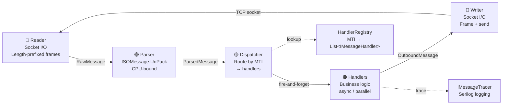
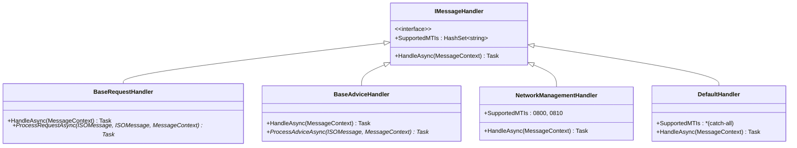

# ISO8583Net

[](https://dotnet.microsoft.com/)
[](https://www.nuget.org/packages/ISO8583Net/)
[](LICENSE)

A high-performance .NET library for building and parsing **ISO 8583** financial transaction messages, plus an **ASP.NET Core hosted service** with a multi-stage SEDA pipeline, pluggable handlers, and Serilog message tracing.

> **Version 2.0.0** — JSON dialect definitions, polymorphic deserialization, and a fully async staged event-driven pipeline.

---

## Features

| Feature | Description |
|---------|-------------|
| **JSON Dialect Configuration** | Define field layouts, message types, and encoding rules in JSON — no recompilation. Built-in VISA and D8 G2B dialects included. |
| **Multiple Encodings** | `BCD`, `BCDU` (unpacked BCD), `ASCII`, `EBCDIC`, `BIN` (binary), and `Z` (track 2 encoding) |
| **Variable & Fixed Length Fields** | Full support for fixed-length and variable-length fields with configurable length indicators |
| **Bitmap Handling** | Automatic primary, secondary, and tertiary bitmap management (fields 1–192) |
| **Bitmap Sub-Fields** | Configurable bitmap-driven sub-fields with their own bitmaps (e.g. VISA F62, F63, F126) |
| **BER-TLV Parsing** | Built-in BER-TLV parser for EMV data (field 55) with recursive construction support |
| **Message Headers** | Pre-built VISA header (22 bytes) and D8 ISO 8583:1993 header (21 bytes ASCII). Extensible via custom header packagers. |
| **Field Interpreters** | Indexed-value interpreters for decoding field sub-components with human-readable labels |
| **SEDA Pipeline** | Five-stage async pipeline (Reader → Parser → Dispatcher → Handlers → Writer) with bounded channels, backpressure control, and circuit breaking |
| **Pluggable Handlers** | `IMessageHandler` interface with built-in `BaseRequestHandler`, `BaseAdviceHandler`, and `NetworkManagementHandler` base classes. Route by MTI. |
| **Message Tracing** | `IMessageTracer` interface hooks into the pipeline. `FileMessageTracer` logs every raw, parsed, and responded message via Serilog. |
| **REST API** | Built-in `/status` and `/health` endpoints exposing pipeline metrics, channel backpressure, handler stats, and overall health |
| **TCP Server** | Async TCP server with TLS/mTLS, periodic SignOn/Echo/SignOff, connection lifecycle management, and graceful shutdown |
| **High Performance** | Span-based bitmap enumeration, delegate dispatch for encodings, `ArrayPool<byte>` support (`PackPooled()`), zero-alloc code paths |
| **Cross-Platform** | Targets .NET 10.0 — runs on Windows, Linux, and macOS |

---

## Quick Start

### Install via NuGet

```bash
dotnet add package ISO8583Net --version 2.0.0
```

### Clone and Build

```bash
git clone https://github.com/nikmes/iso8583net.git
cd iso8583net
dotnet build
```

---

## Usage Example

### Core Library — Build & Parse Messages

```csharp
using ISO8583Net.Message;
using ISO8583Net.Packager;
using ISO8583Net.Utilities;
using Microsoft.Extensions.Logging;
using Serilog;

var serilogLogger = new LoggerConfiguration()
    .MinimumLevel.Debug()
    .WriteTo.Console()
    .CreateLogger();

var loggerFactory = new LoggerFactory().AddSerilog(serilogLogger);
var logger = loggerFactory.CreateLogger<Program>();

// Load the default VISA dialect (embedded resource)
var mPackager = new ISOMessagePackager(logger);

// Create and populate a message
ISOMessage m = new ISOMessage(logger, mPackager);
m.Set(0, "0100");                    // MTI: Authorization Request
m.Set(2, "4000400040004001");        // Primary Account Number (PAN)
m.Set(3, "300000");                  // Processing Code
m.Set(4, "000000002900");            // Transaction Amount
m.Set(7, "1234567890");              // Transmission Date & Time
m.Set(11, "123456");                 // Systems Trace Audit Number (STAN)
m.Set(12, "193012");                 // Local Transaction Time
m.Set(14, "1219");                  // Expiration Date
m.Set(18, "5999");                  // Merchant Category Code (MCC)
m.Set(19, "196");                   // Acquiring Institution Country Code
m.Set(22, "9010");                  // Point of Service Entry Mode
m.Set(25, "23");                    // Point of Service Condition Code
m.Set(37, "123456789012");          // Retrieval Reference Number
m.Set(62, 1, "Y");                  // Sub-field 1 of field 62
m.Set(63, 1, "1222");               // Sub-field 1 of field 63
m.Set(63, 3, "9999");               // Sub-field 3 of field 63
m.Set(64, "ABCDEF1234567890");      // Message Authentication Code (MAC)
m.Set(70, "123");                   // Network Management Information Code
m.Set(132, "ABABABAB");             // Field in tertiary bitmap

Console.WriteLine(m.ToString());

// Pack to bytes
byte[] packedBytes = m.Pack();
Console.WriteLine("Packed bytes:\n" + ISOUtils.PrintHex(packedBytes, packedBytes.Length));

// Unpack from bytes
ISOMessage unpacked = new ISOMessage(logger, mPackager);
unpacked.UnPack(packedBytes);
Console.WriteLine(unpacked.ToString());
```

### Load a Custom Dialect

```csharp
var packager = new ISOMessagePackager(logger, "path/to/my-dialect.json");
var msg = new ISOMessage(logger, packager);
```

### Pooled Packing for Hot Paths

```csharp
byte[] packed = message.PackPooled(); // Uses ArrayPool<byte>.Shared internally
```

### Run the Full Service

```bash
cd tools/ISO8583Service
dotnet run
```

This starts the ASP.NET Core hosted service on port 8583 (configurable in `appsettings.json`) with the D8 G2B dialect, all handlers registered, Serilog tracing, REST `/status` and `/health` endpoints, and Scalar API docs at `/scalar/v1`.

---

## Solution Structure

```
iso8583net/
├── src/
│   ├── ISO8583Net/              # Core library (NuGet package)
│   │   ├── ISOMessage/          # ISOMessage — main public API
│   │   ├── ISOPackager/         # JSON dialect loader, field packagers
│   │   ├── ISOField/            # Field types (flat, bitmap, sub-fields, BER-TLV)
│   │   ├── ISOHeader/           # VISA & D8 message headers
│   │   ├── ISOInterpreter/      # Indexed-value field interpreters
│   │   ├── ISOEnums/            # Encoding, padding, content type enums
│   │   ├── ISOUtils/            # High-speed hex, BCD, EBCDIC converters
│   │   └── ISODialects/         # Embedded dialect JSON files
│   └── ISO8583Server/           # SEDA pipeline server library
│       └── Pipeline/
│           ├── ReaderStage.cs       # Socket → RawMessage channel
│           ├── ParserStage.cs       # RawMessage → ParsedMessage (ISOMessage.UnPack)
│           ├── DispatcherStage.cs   # Route by MTI → handlers, aggregate responses
│           ├── WriterStage.cs       # OutboundMessage → socket
│           ├── ConnectionPipeline.cs  # Per-connection orchestrator
│           ├── PipelineHost.cs      # Accept loop, DI, lifecycle
│           ├── PipelineOptions.cs   # Capacities, concurrency, timeouts
│           ├── PipelineStats.cs     # Metrics (JSON-serializable)
│           ├── Handlers/            # IMessageHandler + base classes
│           └── Messages/            # RawMessage, ParsedMessage, OutboundMessage, MessageContext, IMessageTracer
├── tests/
│   └── ISO8583Net.Tests/        # xUnit suite (22 tests: pipeline, bitmaps, utilities, integration)
├── samples/
│   ├── SimpleTest/              # Console demo
│   ├── TestClient/              # WinForms GUI test client
│   └── TestServer/              # WinForms GUI test server
├── benchmarks/
│   └── ISO8583Net.Benchmarks/   # BenchmarkDotNet (32 benchmarks)
├── tools/
│   └── ISO8583Service/          # ASP.NET Core hosted service (handlers, tracing, REST API)
│       ├── Handlers/            # Concrete handlers: Authorization, Financial, Reversal (+advice variants)
│       ├── Tracing/             # FileMessageTracer (Serilog)
│       ├── HealthChecks/        # Custom health checks
│       └── Controllers/         # REST API controllers
├── docs/
│   ├── handler-development-guide.md   # Complete handler developer guide (Mermaid diagrams)
│   └── specs/                         # Dialect technical specifications
├── tools/ISO8583Service/
│   ├── arch-design.md                 # SEDA architecture proposal
│   └── impl-sprints.md                # Implementation sprint tracking
└── deploy/                      # Linux deployment scripts & systemd unit
```

---

## Built-in Dialects

| Dialect | File | Description |
|---------|------|-------------|
| **VISA BASE I** | `src/ISO8583Net/ISODialects/visa.json` | VISA financial message format, 22-byte header, up to 192 fields. Embedded default. |
| **D8 G2B ISO 8583:1993** | `src/ISO8583Net/ISODialects/d8-iso8583.json` | D8 G2B Payment Platform, 21-byte ASCII header, Fixed TLV in F48, BER-TLV in F55. |

### Writing a Custom Dialect

Create a JSON file using `$type` discriminators:

| `$type` | Purpose |
|---------|---------|
| `"simple"` | Standard flat field |
| `"bitmap"` | Bitmap field (field 1) |
| `"bitmapSubFields"` | Bitmap-driven sub-fields with nested bitmaps |

See the [VISA dialect](src/ISO8583Net/ISODialects/visa.json) and [D8 dialect](src/ISO8583Net/ISODialects/d8-iso8583.json) for complete examples.

---

## Encoding Matrix

| `contentCoding` | Description | Typical Use |
|-----------------|-------------|-------------|
| `BCD` | Binary Coded Decimal | PAN, amounts, STAN |
| `BCDU` | BCD Unpacked | Numeric data with odd lengths |
| `ASCII` | 7/8-bit ASCII text | Alphabetic/numeric fields |
| `EBCDIC` | IBM EBCDIC encoding | Legacy mainframe systems |
| `BIN` | Raw binary | MAC, bitmap, headers |
| `Z` | Track 2 encoding | Magnetic stripe data |

---

## SEDA Pipeline Architecture

The service uses a five-stage **Staged Event-Driven Architecture** per connection, connected by bounded `System.Threading.Channels`:



Each stage runs independently, enabling **message pipelining**: while one message is being parsed, the next is already being read from the socket. Bounded channels provide natural backpressure — when downstream is slow, upstream producers block.

For a full walkthrough, see [arch-design.md](tools/ISO8583Service/arch-design.md).

---

## Handler Framework

Implement business logic by extending base handler classes. The pipeline handles all I/O, framing, parsing, routing, backpressure, and shutdown — you just process the message.



### Quick Handler Example

```csharp
public class AuthorizationHandler : BaseRequestHandler
{
    public AuthorizationHandler(ILogger<AuthorizationHandler> logger) : base(logger) { }

    public override HashSet<string> SupportedMTIs => new() { "0100" };

    protected override Task ProcessRequestAsync(
        ISOMessage request, ISOMessage response, MessageContext context)
    {
        // Your business logic here — check funds, validate card, etc.
        response.Set(39, "00"); // Approval
        return Task.CompletedTask;
    }
}
```

### Registering Handlers

```csharp
builder.Services.AddSingleton<IMessageHandler, AuthorizationHandler>();
builder.Services.AddSingleton<IMessageHandler, FinancialHandler>();
builder.Services.AddSingleton<IMessageHandler, ReversalHandler>();
// ... etc.

// Message tracing
builder.Services.AddSingleton<IMessageTracer, FileMessageTracer>();
```

The active D8 G2B handlers are:

| Handler | MTIs | Base Class | Direction |
|---------|------|------------|-----------|
| `AuthorizationHandler` | 0100 | `BaseRequestHandler` | Request → Response (0110) |
| `AuthorizationAdviceHandler` | 0120 | `BaseAdviceHandler` | Advice (fire-and-forget) |
| `FinancialHandler` | 0200 | `BaseRequestHandler` | Request → Response (0210) |
| `FinancialAdviceHandler` | 0220 | `BaseAdviceHandler` | Advice (fire-and-forget) |
| `ReversalHandler` | 0400 | `BaseRequestHandler` | Request → Response (0410) |
| `ReversalAdviceHandler` | 0420 | `BaseAdviceHandler` | Advice (fire-and-forget) |
| `NetworkManagementHandler` | 0800 | `IMessageHandler` | Echo/SignOn/SignOff |
| `DefaultHandler` | * | `IMessageHandler` | Catch-all (auto-approve) |

**Full developer guide:** [docs/handler-development-guide.md](docs/handler-development-guide.md)

---

## Message Tracing

Every message flowing through the pipeline can be traced via the `IMessageTracer` interface. The built-in `FileMessageTracer` logs structured events using Serilog:

```
RECV | MTI=1100 | Conn=1 | Fields=17 | ...
SEND | MTI=1110 | Conn=1 | Fields=5 | Elapsed=1.23ms | ...
```

| Hook Point | Method | When |
|------------|--------|------|
| After parse | `OnMessageReceived` | Message successfully unpacked |
| Parse failure | `OnParseError` | Invalid bytes received |
| After handler | `OnMessageResponded` | Response sent to client |
| No response | `OnNoResponse` | Handler chose not to respond (e.g. advice) |
| Handler error | `OnHandlerError` | Exception in business logic |

```csharp
// Zero-overhead default (JIT-eliminated)
public class NoopMessageTracer : IMessageTracer { }

// Serilog-based (registered in DI)
builder.Services.AddSingleton<IMessageTracer, FileMessageTracer>();
```

---

## Benchmarks

*Measured with BenchmarkDotNet v0.15.8 on Intel Core i9-14900K, .NET 10.0.10, Windows 11.*

### Pipeline Throughput

| Scenario | Throughput |
|----------|-----------:|
| Single connection, parse + dispatch | ~470,000 msg/sec |
| 100 connections (SEDA pipeline) | ~270,000 msg/sec |

### Message Roundtrip (Pack + UnPack)

| Method | Mean | Allocated |
|--------|-----:|----------:|
| PackUnpack_1stBitmap | 1,824.7 ns | 9.63 KB |
| PackUnpack_2ndBitmap | 1,983.9 ns | 9.97 KB |
| PackUnpack_3rdBitmap | 2,235.4 ns | 10.16 KB |
| PackUnpack_WithSubfields | 2,229.3 ns | 12.09 KB |
| PackUnpack_1stBitmap_Pooled | 1,795.4 ns | 7.61 KB |

### Pack-Only / Unpack-Only

| Method | Mean | Allocated |
|--------|-----:|----------:|
| PackOnly_1stBitmap | 1,011.9 ns | 5.37 KB |
| PackOnly_1stBitmap_Pooled | **874.9 ns** | **3.34 KB** |
| UnpackOnly_1stBitmap | 1,947.3 ns | 4.18 KB |

### Low-Level Encoding

| Method | Mean | Allocated |
|--------|-----:|----------:|
| Hex2Bytes_16 | 6.632 ns | 32 B |
| Ascii2Bcd_16 | 6.270 ns | 40 B |
| Bcd2Ascii_16 | 17.066 ns | 96 B |

Full reports and charts: [benchmarks/ISO8583Net.Benchmarks/BenchmarkDotNet.Artifacts/](benchmarks/ISO8583Net.Benchmarks/BenchmarkDotNet.Artifacts/)

---

## Documentation

- 📘 [Handler Development Guide](docs/handler-development-guide.md) — comprehensive guide with Mermaid diagrams
- 🏗️ [Architecture Design](tools/ISO8583Service/arch-design.md) — SEDA pipeline proposal and rationale
- 📋 [Implementation Sprints](tools/ISO8583Service/impl-sprints.md) — sprint-by-sprint build log

---

## License

This project is licensed under the **MIT License**. See the [LICENSE](LICENSE) file for details.

---

## Links

- 📦 [NuGet Package](https://www.nuget.org/packages/ISO8583Net/)
- 🐛 [Issue Tracker](https://github.com/nikmes/iso8583net/issues)
