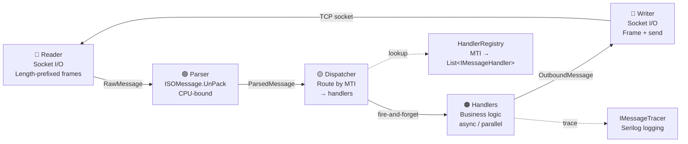
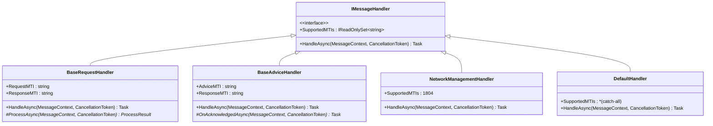

# ISO8583Net

[](https://dotnet.microsoft.com/)
[](https://www.nuget.org/packages/ISO8583Net/)
[](LICENSE)

A high-performance .NET library for building and parsing **ISO 8583** financial transaction messages, plus an **ASP.NET Core hosted service** with a multi-stage SEDA pipeline, pluggable handlers, and Serilog message tracing.

> **Version 2.0.0** — JSON dialect definitions, polymorphic deserialization, and a fully async staged event-driven pipeline.

---

## Features

| Feature | Description |
|---------|-------------|
| **JSON Dialect Configuration** | Define field layouts, message types, and encoding rules in JSON — no recompilation. Built-in VISA and D8 G2B dialects included. |
| **Multiple Encodings** | `BCD`, `BCDU` (unpacked BCD), `ASCII`, `EBCDIC`, `BIN` (binary), and `Z` (track 2 encoding) |
| **Variable & Fixed Length Fields** | Full support for fixed-length and variable-length fields with configurable length indicators |
| **Bitmap Handling** | Automatic primary, secondary, and tertiary bitmap management (fields 1–192) |
| **Bitmap Sub-Fields** | Configurable bitmap-driven sub-fields with their own bitmaps (e.g. VISA F62, F63, F126) |
| **BER-TLV Parsing & Logging** | Built-in BER-TLV parser for EMV data (field 55) with recursive construction support and human-readable tag descriptions |
| **Message Headers** | Pre-built VISA header (22 bytes) and D8 ISO 8583:1993 header (21 bytes ASCII). Extensible via custom header packagers. |
| **Field Interpreters** | Indexed-value, Fixed-TLV, and BER-TLV interpreters for decoding field sub-components with human-readable labels |
| **SEDA Pipeline** | Five-stage async pipeline (Reader → Parser → Dispatcher → Handlers → Writer) with bounded channels, backpressure control, and circuit breaking |
| **Pluggable Handlers** | `IMessageHandler` interface with built-in `BaseRequestHandler`, `BaseAdviceHandler`, and `NetworkManagementHandler` base classes. Route by MTI. |
| **Message Tracing** | `IMessageTracer` interface hooks into the pipeline. `FileMessageTracer` logs every raw, parsed, and responded message via Serilog; optional `EfMessageTracer` persists traces to PostgreSQL. |
| **REST API** | Built-in `/status` and `/health` endpoints exposing pipeline metrics, channel backpressure, handler stats, and overall health |
| **TCP Server** | Async TCP server with TLS/mTLS, periodic SignOn/Echo/SignOff, connection lifecycle management, and graceful shutdown |
| **High Performance** | Span-based bitmap enumeration, delegate dispatch for encodings, `ArrayPool<byte>` support (`PackPooled()`), zero-alloc code paths |
| **Cross-Platform** | Targets .NET 10.0 — runs on Windows, Linux, and macOS |

---

## Quick Start

### Install via NuGet

```bash
dotnet add package ISO8583Net --version 2.0.0
```

### Clone and Build

```bash
git clone https://github.com/nikmes/iso8583net.git
cd iso8583net

# On Windows (full solution)
dotnet build iso8583net.sln

# On Linux/macOS the WinForms samples do not build; build the core, server, service, and tests directly
dotnet build src/ISO8583Net/ISO8583Net.csproj
dotnet build src/ISO8583Server/ISO8583Server.csproj
dotnet build tools/ISO8583Service/ISO8583Service.csproj
dotnet test tests/ISO8583Net.Tests/ISO8583Tests.csproj
```

---

## Usage Example

### Core Library — Build & Parse Messages

```csharp
using ISO8583Net.Message;
using ISO8583Net.Packager;
using ISO8583Net.Utilities;
using Microsoft.Extensions.Logging;
using Serilog;

var serilogLogger = new LoggerConfiguration()
    .MinimumLevel.Debug()
    .WriteTo.Console()
    .CreateLogger();

var loggerFactory = new LoggerFactory().AddSerilog(serilogLogger);
var logger = loggerFactory.CreateLogger<Program>();

// Load the default VISA dialect (embedded resource)
var mPackager = new ISOMessagePackager(logger);

// Create and populate a message
ISOMessage m = new ISOMessage(logger, mPackager);
m.Set(0, "0100");                    // MTI: Authorization Request
m.Set(2, "4000400040004001");        // Primary Account Number (PAN)
m.Set(3, "300000");                  // Processing Code
m.Set(4, "000000002900");            // Transaction Amount
m.Set(7, "1234567890");              // Transmission Date & Time
m.Set(11, "123456");                 // Systems Trace Audit Number (STAN)
m.Set(12, "193012");                 // Local Transaction Time
m.Set(14, "1219");                  // Expiration Date
m.Set(18, "5999");                  // Merchant Category Code (MCC)
m.Set(19, "196");                   // Acquiring Institution Country Code
m.Set(22, "9010");                  // Point of Service Entry Mode
m.Set(25, "23");                    // Point of Service Condition Code
m.Set(37, "123456789012");          // Retrieval Reference Number
m.Set(62, 1, "Y");                  // Sub-field 1 of field 62
m.Set(63, 1, "1222");               // Sub-field 1 of field 63
m.Set(63, 3, "9999");               // Sub-field 3 of field 63
m.Set(64, "ABCDEF1234567890");      // Message Authentication Code (MAC)
m.Set(70, "123");                   // Network Management Information Code
m.Set(132, "ABABABAB");             // Field in tertiary bitmap

Console.WriteLine(m.ToString());

// Pack to bytes
byte[] packedBytes = m.Pack();
Console.WriteLine("Packed bytes:\n" + ISOUtils.PrintHex(packedBytes, packedBytes.Length));

// Unpack from bytes
ISOMessage unpacked = new ISOMessage(logger, mPackager);
unpacked.UnPack(packedBytes);
Console.WriteLine(unpacked.ToString());
```

### Load a Custom Dialect

```csharp
var packager = new ISOMessagePackager(logger, "path/to/my-dialect.json");
var msg = new ISOMessage(logger, packager);
```

### Pooled Packing for Hot Paths

```csharp
byte[] packed = message.PackPooled(); // Uses ArrayPool<byte>.Shared internally
```

### Run the Full Service

```bash
cd tools/ISO8583Service
dotnet run
```

This starts the ASP.NET Core hosted service with the D8 G2B dialect. By default:
- ISO 8583 TCP server listens on port **9443** (configurable in `appsettings.json`).
- REST API listens on port **5000** with endpoints `/api/iso8583/status`, `/api/iso8583/signon`, `/api/iso8583/signoff`, `/api/iso8583/echo`, `/api/iso8583/config`, plus `/health`.
- Scalar API docs are available at `/scalar/v1` and the OpenAPI spec at `/openapi/v1.json`.

---

## Solution Structure

```
iso8583net/
├── src/
│   ├── ISO8583Net/              # Core library (NuGet package)
│   │   ├── ISOMessage/          # ISOMessage — main public API
│   │   ├── ISOPackager/         # JSON dialect loader, field packagers
│   │   ├── ISOField/            # Field types (flat, bitmap, sub-fields, BER-TLV)
│   │   ├── ISOHeader/           # VISA & D8 message headers
│   │   ├── ISOInterpreter/      # Indexed-value, Fixed-TLV, and BER-TLV interpreters
│   │   ├── ISOEnums/            # Encoding, padding, content type enums
│   │   ├── ISOUtils/            # High-speed hex, BCD, EBCDIC converters
│   │   └── ISODialects/         # Embedded dialect JSON files
│   └── ISO8583Server/           # SEDA pipeline server library
│       └── Pipeline/
│           ├── ReaderStage.cs       # Socket → RawMessage channel
│           ├── ParserStage.cs       # RawMessage → ParsedMessage (ISOMessage.UnPack)
│           ├── DispatcherStage.cs   # Route by MTI → handlers
│           ├── WriterStage.cs       # OutboundMessage → socket
│           ├── ConnectionPipeline.cs  # Per-connection orchestrator
│           ├── PipelineHost.cs      # Accept loop, DI, lifecycle
│           ├── PipelineOptions.cs   # Capacities, concurrency, timeouts
│           ├── PipelineStats.cs     # Metrics (JSON-serializable)
│           ├── Handlers/            # IMessageHandler + base classes
│           └── Messages/            # RawMessage, ParsedMessage, OutboundMessage, MessageContext, IMessageTracer
├── tests/
│   └── ISO8583Net.Tests/        # xUnit suite (25 tests: pipeline, bitmaps, utilities, integration, dialect interpreters)
├── samples/
│   ├── SimpleTest/              # Console demo
│   ├── HexParser/               # Hex parser CLI demo (Windows/WinForms)
│   ├── TestClient/              # WinForms GUI test client (Windows only)
│   └── TestServer/              # WinForms GUI test server (Windows only)
├── benchmarks/
│   └── ISO8583Net.Benchmarks/   # BenchmarkDotNet suite
├── tools/
│   ├── ISO8583Service/          # ASP.NET Core hosted service
│   │   ├── Handlers/            # Concrete D8 handlers
│   │   ├── Tracing/             # FileMessageTracer and optional EF Core PostgreSQL tracer
│   │   ├── HealthChecks/        # Pipeline health checks
│   │   └── Controllers/         # REST API controllers
│   └── ISO8583Simulator/        # Standalone client simulator
│       ├── Scenarios/           # Built-in test scenarios
│       └── docker-compose.simulator.yml
├── docs/
│   ├── handler-development-guide.md   # Complete handler developer guide
│   ├── arch-design.md                 # SEDA architecture proposal
│   ├── impl-sprints.md                # Implementation sprint tracking
│   └── specs/                         # Dialect technical specifications
└── deploy/                      # Linux deployment scripts & systemd unit
```

---

## Built-in Dialects

| Dialect | File | Description |
|---------|------|-------------|
| **VISA BASE I** | `src/ISO8583Net/ISODialects/visa.json` | VISA financial message format, 22-byte header, up to 192 fields. Embedded default. |
| **D8 G2B ISO 8583:1993** | `src/ISO8583Net/ISODialects/d8-iso8583.json` | D8 G2B Payment Platform, 21-byte ASCII header, Fixed-TLV interpreter in F48, BER-TLV interpreter in F55. |

### Writing a Custom Dialect

Create a JSON file using `$type` discriminators:

| `$type` | Purpose |
|---------|---------|
| `"simple"` | Standard flat field |
| `"bitmap"` | Bitmap field (field 1) |
| `"bitmapSubFields"` | Bitmap-driven sub-fields with nested bitmaps |

See the [VISA dialect](src/ISO8583Net/ISODialects/visa.json) and [D8 dialect](src/ISO8583Net/ISODialects/d8-iso8583.json) for complete examples.

---

## Encoding Matrix

| `contentCoding` | Description | Typical Use |
|-----------------|-------------|-------------|
| `BCD` | Binary Coded Decimal | PAN, amounts, STAN |
| `BCDU` | BCD Unpacked | Numeric data with odd lengths |
| `ASCII` | 7/8-bit ASCII text | Alphabetic/numeric fields |
| `EBCDIC` | IBM EBCDIC encoding | Legacy mainframe systems |
| `BIN` | Raw binary | MAC, bitmap, headers |
| `Z` | Track 2 encoding | Magnetic stripe data |

---

## Structured Field Logging

The D8 dialect includes interpreters that break complex TLV fields into human-readable tag listings when you call `ISOMessage.ToString()` or use the built-in `FileMessageTracer`.

### Field 48 — Fixed TLV

```csharp
msg.Set(48, "C00703303030C0090100C0100108");
Console.WriteLine(msg.GetField(48));
```

```
F[048] [C00703303030C0090100C0100108]
       [Tag C007] [ICC Additional POS information] [Len 3]
            Hex:  303030
            ASCII: 000
       [Tag C009] [Terminal Type] [Len 1]
            Hex:  00
       [Tag C010] [Point of Service Condition Code] [Len 1]
            Hex:  08
```

### Field 55 — BER-TLV (EMV)

```csharp
msg.Set(55, "5F2A0209789F02060000000100009F34031E0300");
Console.WriteLine(msg.GetField(55));
```

```
F[055] [5F2A0209789F02060000000100009F34031E0300]
       [Tag 5F2A] [Transaction Currency Code] [Len 2]
            Hex:  0978
       [Tag 9F02] [Amount, Authorised] [Len 6]
            Hex:  000000010000
       [Tag 9F34] [Cardholder Verification Method (CVM) Results] [Len 3]
            Hex:  1E0300
```

Tag descriptions are loaded from the dialect JSON; add any extra tags you need to the `interpreter.tags` array for field 48 or 55.

---

## SEDA Pipeline Architecture

The service uses a five-stage **Staged Event-Driven Architecture** per connection, connected by bounded `System.Threading.Channels`:


```mermaid
flowchart LR
    R["🔵 Reader<br/>Socket I/O<br/>Length-prefixed frames"] -->|RawMessage| P["🟢 Parser<br/>ISOMessage.UnPack<br/>CPU-bound"]
    P -->|ParsedMessage| D["🟡 Dispatcher<br/>Route by MTI<br/>→ handlers"]
    D -->|fire-and-forget| H["🟠 Handlers<br/>Business logic<br/>async / parallel"]
    H -->|OutboundMessage| W["🔴 Writer<br/>Socket I/O<br/>Frame + send"]
    W -->|TCP socket| R

    D -.->|lookup| Registry["HandlerRegistry<br/>MTI → List&lt;IMessageHandler&gt;"]
    H -.->|trace| Tracer["IMessageTracer<br/>Serilog logging"]
```

Each stage runs independently, enabling **message pipelining**: while one message is being parsed, the next is already being read from the socket. Bounded channels provide natural backpressure — when downstream is slow, upstream producers block.

For a full walkthrough, see [arch-design.md](docs/arch-design.md).

---

## Handler Framework

Implement business logic by extending base handler classes. The pipeline handles all I/O, framing, parsing, routing, backpressure, and shutdown — you just process the message.


```mermaid
classDiagram
    class IMessageHandler {
        &lt;&lt;interface&gt;&gt;
        +SupportedMTIs : IReadOnlySet&lt;string&gt;
        +HandleAsync(MessageContext, CancellationToken) Task
    }
    class BaseRequestHandler {
        +RequestMTI : string
        +ResponseMTI : string
        +HandleAsync(MessageContext, CancellationToken) Task
        #ProcessAsync(MessageContext, CancellationToken) ProcessResult*
    }
    class BaseAdviceHandler {
        +AdviceMTI : string
        +ResponseMTI : string
        +HandleAsync(MessageContext, CancellationToken) Task
        #OnAcknowledgedAsync(MessageContext, CancellationToken) Task*
    }
    class NetworkManagementHandler {
        +SupportedMTIs : 1804
        +HandleAsync(MessageContext, CancellationToken) Task
    }
    class DefaultHandler {
        +SupportedMTIs : * (catch-all)
        +HandleAsync(MessageContext, CancellationToken) Task
    }

    IMessageHandler <|-- BaseRequestHandler
    IMessageHandler <|-- BaseAdviceHandler
    IMessageHandler <|-- NetworkManagementHandler
    IMessageHandler <|-- DefaultHandler
```

### Quick Handler Example

```csharp
public class AuthorizationHandler : BaseRequestHandler
{
    public AuthorizationHandler(ILogger<AuthorizationHandler>? logger = null) : base(logger) { }

    public override string RequestMTI => "1100";
    public override string ResponseMTI => "1110";

    protected override Task<ProcessResult> ProcessAsync(
        MessageContext context, CancellationToken ct)
    {
        // Your business logic here — check funds, validate card, etc.
        return Task.FromResult(ProcessResult.Approved("AUTH01"));
    }
}
```

### Registering Handlers

```csharp
builder.Services.AddSingleton<IMessageHandler, AuthorizationHandler>();
builder.Services.AddSingleton<IMessageHandler, AuthorizationAdviceHandler>();
builder.Services.AddSingleton<IMessageHandler, FinancialHandler>();
builder.Services.AddSingleton<IMessageHandler, FinancialAdviceHandler>();
builder.Services.AddSingleton<IMessageHandler, ReversalHandler>();
builder.Services.AddSingleton<IMessageHandler, ReversalAdviceHandler>();

// Catch-all and network management are also registered by default:
builder.Services.AddSingleton<IMessageHandler, DefaultHandler>();
builder.Services.AddSingleton<IMessageHandler, NetworkManagementHandler>();
```

The active D8 G2B handlers are:

| Handler | MTIs | Base Class | Direction |
|---------|------|------------|-----------|
| `AuthorizationHandler` | 1100 | `BaseRequestHandler` | Request → Response (1110) |
| `AuthorizationAdviceHandler` | 1120 | `BaseAdviceHandler` | Advice → Ack (1130) |
| `FinancialHandler` | 1200 | `BaseRequestHandler` | Request → Response (1210) |
| `FinancialAdviceHandler` | 1220 | `BaseAdviceHandler` | Advice → Ack (1230) |
| `ReversalHandler` | 1400 | `BaseRequestHandler` | Request → Response (1410) |
| `ReversalAdviceHandler` | 1420 | `BaseAdviceHandler` | Advice → Ack (1430) |
| `NetworkManagementHandler` | 1804 | `IMessageHandler` | Logon/Logoff/KeyChange/Echo → 1814 |
| `DefaultHandler` | * | `IMessageHandler` | Catch-all (1800→1814 echo, passthrough) |

**Full developer guide:** [docs/handler-development-guide.md](docs/handler-development-guide.md)

---

## Message Tracing

Every message flowing through the pipeline can be traced via the `IMessageTracer` interface. `ISO8583Service` registers `FileMessageTracer` by default; it logs structured events via Serilog:

```
RECV | MTI=1100 | Conn=1 | Fields=17 | ...
SEND | MTI=1110 | Conn=1 | Fields=5 | Elapsed=1.23ms | ...
```

| Hook Point | Method | When |
|------------|--------|------|
| After parse | `OnMessageReceived` | Message successfully unpacked |
| Parse failure | `OnParseError` | Invalid bytes received |
| After handler | `OnMessageResponded` | Response sent to client |
| No response | `OnNoResponse` | Handler chose not to respond (e.g. advice) |
| Handler error | `OnHandlerError` | Exception in business logic |

```csharp
// Default in ISO8583Service — zero configuration
builder.Services.AddSingleton<IMessageTracer, FileMessageTracer>();

// Optional: persist traces to PostgreSQL
// "MessageTrace:Enabled"=true and "MessageTrace:Provider"="PostgreSQL" in appsettings.json
builder.Services.AddSingleton<IMessageTracer, EfMessageTracer>();
```

---

## Benchmarks

*Measured with BenchmarkDotNet v0.15.8 on Intel Core i9-14900K, .NET 10.0.10, Windows 11.*

### Pipeline Throughput

| Scenario | Throughput |
|----------|-----------:|
| Single connection, parse + dispatch | ~470,000 msg/sec |
| 100 connections (SEDA pipeline) | ~270,000 msg/sec |

### Message Roundtrip (Pack + UnPack)

| Method | Mean | Allocated |
|--------|-----:|----------:|
| PackUnpack_1stBitmap | 1,824.7 ns | 9.63 KB |
| PackUnpack_2ndBitmap | 1,983.9 ns | 9.97 KB |
| PackUnpack_3rdBitmap | 2,235.4 ns | 10.16 KB |
| PackUnpack_WithSubfields | 2,229.3 ns | 12.09 KB |
| PackUnpack_1stBitmap_Pooled | 1,795.4 ns | 7.61 KB |

### Pack-Only / Unpack-Only

| Method | Mean | Allocated |
|--------|-----:|----------:|
| PackOnly_1stBitmap | 1,011.9 ns | 5.37 KB |
| PackOnly_1stBitmap_Pooled | **874.9 ns** | **3.34 KB** |
| UnpackOnly_1stBitmap | 1,947.3 ns | 4.18 KB |

### Low-Level Encoding

| Method | Mean | Allocated |
|--------|-----:|----------:|
| Hex2Bytes_16 | 6.632 ns | 32 B |
| Ascii2Bcd_16 | 6.270 ns | 40 B |
| Bcd2Ascii_16 | 17.066 ns | 96 B |

Full reports and charts: [benchmarks/ISO8583Net.Benchmarks/BenchmarkDotNet.Artifacts/](benchmarks/ISO8583Net.Benchmarks/BenchmarkDotNet.Artifacts/)

---

## Documentation

- 📘 [Handler Development Guide](docs/handler-development-guide.md) — comprehensive guide with Mermaid diagrams
- 🏗️ [Architecture Design](docs/arch-design.md) — SEDA pipeline proposal and rationale
- 📋 [Implementation Sprints](docs/impl-sprints.md) — sprint-by-sprint build log
- 🚀 [ISO8583Service README](tools/ISO8583Service/README.md) — service setup, REST API, and configuration
- 🎮 [ISO8583Simulator README](tools/ISO8583Simulator/README.md) — simulator scenarios and usage

---

## License

This project is licensed under the **MIT License**.

---

## Links

- 📦 [NuGet Package](https://www.nuget.org/packages/ISO8583Net/)
- 🐛 [Issue Tracker](https://github.com/nikmes/iso8583net/issues)
