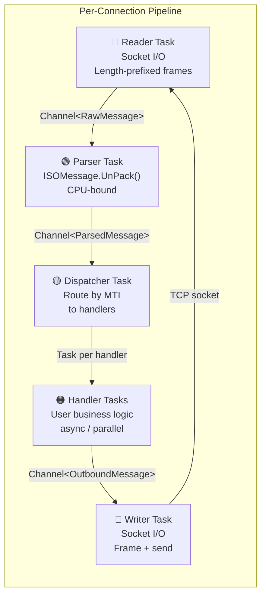

# ISO8583Service — SEDA Pipeline Architecture

> Status: **Implemented.** The architecture described below is what
> `src/ISO8583Server` ships today. The problem statement and migration phases
> are retained for historical context only.

## Problem Statement

Before the pipeline refactor, `Iso8583TcpServer` processed each client
connection in a single sequential loop: **read → parse → auto-respond → read
next**. This created several bottlenecks:

| Bottleneck | Impact |
|---|---|
| Sequential read-process-respond | Next message waits for current to fully complete — head-of-line blocking |
| Parsing in the read loop | Socket can't be drained while CPU is busy unpacking |
| Synchronous `OnMessageParsed` callback | No async business logic; handlers block the read loop |
| 1-second polling timeout for SignOn | Allocates `CancellationTokenSource` per iteration, wasteful wake-ups |
| No message pipelining | Only one in-flight message per connection at any time |

When processing hundreds of messages/sec from a single connection, every
microsecond the read loop spends outside `ReadAsync` is backpressure on the
sender. We need to decouple I/O from processing.

---

## Proposed Architecture: Staged Event-Driven Pipeline (SEDA)

Split the per-connection message flow into **five independent async stages**
connected by bounded `System.Threading.Channels`:



### Stage 1 — Reader (I/O-bound)

- Runs a tight `while(true)` loop: `ReadExactlyAsync(2)` for length prefix → `ReadExactlyAsync(len)` for body
- Pushes `RawMessage { Bytes, ConnNum, ReceivedAt }` into a bounded `Channel<RawMessage>`
- Returns rented buffer to `ArrayPool` **after** the parser consumes it (via channel completion)
- No parsing, no logging in the hot path — just `ReadAsync` → push → next
- **Outcome:** Socket is drained at line rate; reader never blocks on processing

### Stage 2 — Parser (CPU-bound)

- Reads from `Channel<RawMessage>`, calls `ISOMessage.UnPack()`
- Returns `ArrayPool<byte>` buffer to pool after unpacking
- Pushes `ParsedMessage { ISOMessage, RawBytes (hex), ConnNum }` into `Channel<ParsedMessage>`
- Can run multiple parser tasks per connection for extreme throughput (configurable concurrency)
- **Outcome:** Parsing is decoupled from socket I/O; messages queue up during CPU spikes

### Stage 3 — Dispatcher (Routing)

- Reads from `Channel<ParsedMessage>`, inspects MTI (field 0)
- Looks up registered `IMessageHandler` for that MTI (or falls back to default)
- Fires handler **as a fire-and-forget task** — dispatcher immediately reads next message
- Passes a `MessageContext` that includes the `ChannelWriter<OutboundMessage>` for responses
- **Outcome:** Messages are routed and handled in parallel; dispatcher never blocks

### Stage 4 — Message Handlers (User Code)

```csharp
public interface IMessageHandler
{
    /// <summary>
    /// MTIs this handler processes (e.g. ["1804", "1814"]).
    /// Use ["*"] for a catch-all handler.
    /// </summary>
    IReadOnlySet<string> SupportedMTIs { get; }

    /// <summary>
    /// Handle an incoming ISO 8583 message.
    /// Return an ISOMessage to send a response, or null to skip.
    /// </summary>
    Task<ISOMessage?> HandleAsync(MessageContext ctx, CancellationToken ct);
}

public sealed class MessageContext
{
    public ISOMessage Request { get; init; }
    public int ConnectionNumber { get; init; }
    public string RemoteEndpoint { get; init; }
    public DateTime ReceivedAt { get; init; }

    /// <summary>Send a response back to this client.</summary>
    public ValueTask SendResponseAsync(ISOMessage response, CancellationToken ct = default);

    /// <summary>Send a raw byte response (pre-framed, length prefix included).</summary>
    public ValueTask SendRawResponseAsync(byte[] preFramed, CancellationToken ct = default);
}
```

Handlers are registered via DI:

```csharp
// Program.cs — D8 G2B dialect MTIs
builder.Services.AddSingleton<IMessageHandler, AuthorizationHandler>();  // MTI 1100
builder.Services.AddSingleton<IMessageHandler, FinancialHandler>();      // MTI 1200
builder.Services.AddSingleton<IMessageHandler, ReversalHandler>();       // MTI 1400
builder.Services.AddSingleton<IMessageHandler, NetworkManagementHandler>(); // MTI 1804
```

- Each handler runs independently — 100 messages can be in-flight simultaneously
- Responses are written to the **per-connection writer channel** — not directly to the socket
- **Outcome:** Business logic is isolated, testable, and naturally parallel. No ordering guarantee.

### Stage 5 — Writer (I/O-bound)

- Reads from `Channel<OutboundMessage>`, frames with 2-byte length prefix, calls `stream.WriteAsync`
- Single writer **per connection** guarantees no interleaved writes on the socket
- Writes are serialized but non-blocking for handlers (they just push to the channel)
- **Outcome:** Write ordering is preserved per-connection; handlers never touch the socket

---

## Key Design Decisions

### 1. Bounded Channels for Backpressure

All channels are bounded (e.g., capacity 256). When the parser can't keep up with the reader,
the reader's `WriteAsync` will asynchronously wait — applying natural backpressure to the TCP socket.

```csharp
var rawChannel = Channel.CreateBounded<RawMessage>(new BoundedChannelOptions(256)
{
    FullMode = BoundedChannelFullMode.Wait  // backpressure the reader
});
```

### 2. ArrayPool Ownership Transfer

`RawMessage` carries an `ArrayPool<byte>` lease. The parser **returns** it after unpacking.
Zero-copy where possible; the raw bytes are only used for hex-dump logging (optional,
can be disabled for max throughput).

### 3. No Ordering Guarantee

Messages A, B, C arrive in order. Handler A takes 50ms, handler B takes 2ms.
Response B is sent before response A. This is by design — the ISO 8583 wire protocol
does not mandate response ordering (each message is self-contained with STAN/DATE).

If ordering is required for a specific MTI, register a **single-threaded** handler
(configured per-handler, not globally).

### 4. SignOn / Echo Moved Out of Hot Path

Periodic SignOn and Echo are managed by a **separate background timer** that pushes
directly to the writer channel — no polling in the read loop.

### 5. Graceful Shutdown

When `StopAsync` is called:
1. Reader stops accepting from socket
2. Channels are completed (`Writer.Complete()`)
3. Parser, dispatcher drain remaining messages
4. Handlers finish in-flight work
5. Writer sends remaining queued responses
6. Socket closed

Timeout configurable (e.g., 30 seconds), after which pending work is discarded.

---

## Pipeline Host

A singleton `PipelineHost` manages all connections:

```csharp
public sealed class PipelineHost
{
    // Set the loaded dialect packager (called by Iso8583TcpServer.StartAsync)
    public void SetPackager(ISOMessagePackager packager);

    // Fail fast if any registered handler declares an MTI outside the dialect
    public void ValidateHandlers();

    // Start a pipeline for a new connection
    public ConnectionPipeline Accept(Stream stream, int connectionNumber,
        string remoteEndpoint, CancellationToken ct);

    // Outbound dialect validation mode (Off/Warn/On), runtime-toggleable
    public DialectValidationMode DialectValidationMode { get; set; }

    // Active connections for monitoring
    public IReadOnlyList<PipelineStats> GetStats();

    // Graceful shutdown
    public Task StopAllAsync(CancellationToken ct = default);
}

public sealed class PipelineStats
{
    public int ConnectionNumber { get; init; }
    public string RemoteEndpoint { get; init; }
    public DateTime ConnectedAt { get; init; }
    public long MessagesReceived { get; }
    public long MessagesSent { get; }
    public long ParseErrors { get; }
    public long HandlerErrors { get; }
    public long BytesReceived { get; }
    public long BytesSent { get; }
    public int InFlight { get; set; }          // messages being processed
    public int WriteQueueLength { get; set; }
    public int MaxInFlight { get; set; }
    public int MaxWriteQueueLength { get; set; }
}
```

---

## Configuration

```json
{
  "Iso8583Server": {
    "Port": 9443,
    "DialectPath": "Dialects/d8-iso8583.json",
    "SignOnIntervalSeconds": 30,
    "SendSignOnOnConnect": false,
    "EnablePeriodicSignOn": false,
    "DialectValidationMode": "Off",

    // TLS
    "TlsEnabled": true,
    "TlsCertPath": "/etc/d8dh/certs/server.crt",
    "TlsKeyPath": "/etc/d8dh/certs/server.key",
    "TlsCaCertPath": "/etc/d8dh/certs/ca.pem",
    "TlsRequireClientCert": false
  },

  "Iso8583Pipeline": {
    // Pipeline tuning
    "ParserConcurrency": 2,
    "RawMessageCapacity": 256,
    "ParsedMessageCapacity": 512,
    "OutboundMessageCapacity": 256,

    // Shutdown
    "DrainTimeoutSeconds": 30,

    // Parser circuit breaker
    "MaxParseErrorsBeforePause": 0,
    "ParserCooldownSeconds": 5
  }
}
```

Note the pipeline settings live in their own `Iso8583Pipeline` section
(`PipelineOptions`), separate from the `Iso8583Server` section (`ServerOptions`).

---

## Migration Status

Phases 1 and 2 shipped; Phase 3 is still future work:

- **Phase 1 — Refactor `Iso8583TcpServer` internals** ✅
  `Iso8583TcpServer` now delegates to `PipelineHost`; `IMessageHandler` is
  registered via DI; the `OnMessageParsed` callback is retained for legacy
  callers and `DefaultHandler` is the catch-all.
- **Phase 2 — Optimize** ✅
  Channel capacities and parser concurrency are tunable via `PipelineOptions`;
  `PipelineStats` is exposed in `GET /api/iso8583/status` and `GET /health`.
- **Phase 3 — Advanced** (not yet started)
  `ReadOnlySequence<byte>` zero-copy parsing (PipeReader) and
  `IBufferWriter<byte>` zero-copy packing remain future work; the current
  pipeline uses `ArrayPool<byte>`-backed `RawMessage` buffers.

---

## Measured Performance (BenchmarkDotNet)

All benchmarks on Intel Core i9-14900K, .NET 10, Release build, in-memory SplitStream (no network I/O).

| Metric | Value | Notes |
|---|---|---|
| **Single msg round-trip** | **~19 μs** (P50) | Includes frame→parse→dispatch→echo→frame→write; ~17 KB allocated |
| **Throughput (single conn)** | **~470,000 msg/sec** | 1000 messages processed in 2.1 ms; parser concurrency=2 |
| **P99 latency (1K batch)** | **~3.0 μs** | Per-message handler time; uniform under balanced load |
| **P99 latency (5K batch)** | **~6.0 μs** | GC becomes a factor at larger batch sizes |
| **Parser concurrency sweet spot** | **2 tasks** | 1→2: ~25% speedup; 4/8: no further gain, adds GC pressure |
| **Memory per round-trip** | **~17 KB** | Mostly ISOMessage allocations; zero-copy possible for raw bytes |

### Tuning Recommendations

| Setting | Default | Rationale |
|---|---|---|
| `ParserConcurrency` | **2** | Optimal from benchmarks; 1 is slightly slower, 4+ increases GC without throughput gain |
| `RawMessageCapacity` | **256** | Covers burst reads without consuming excess memory |
| `ParsedMessageCapacity` | **512** | Larger than raw to absorb parser concurrency bursts |
| `OutboundMessageCapacity` | **256** | Bounded with `Wait` mode provides natural TCP backpressure |
| `DrainTimeoutSeconds` | **30** | Generous timeout for in-flight handlers during graceful shutdown |

---

## File Layout

```
src/
├── ISO8583Net/                  (core library)
├── ISO8583Server/               (TCP server library)
│   ├── Pipeline/
│   │   ├── PipelineHost.cs          (manages all connection pipelines)
│   │   ├── ConnectionPipeline.cs    (per-connection 5-stage pipeline)
│   │   ├── ReaderStage.cs           (socket → RawMessage channel)
│   │   ├── ParserStage.cs           (RawMessage → ParsedMessage channel)
│   │   ├── DispatcherStage.cs       (ParsedMessage → handlers)
│   │   ├── WriterStage.cs           (OutboundMessage channel → socket)
│   │   ├── ErrorResponseBuilder.cs  (raw D8 9xxx/9800 format-error frames)
│   │   ├── PipelineOptions.cs
│   │   ├── PipelineStats.cs
│   │   ├── Handlers/
│   │   │   ├── IMessageHandler.cs
│   │   │   ├── BaseRequestHandler.cs
│   │   │   ├── BaseAdviceHandler.cs
│   │   │   ├── NetworkManagementHandler.cs
│   │   │   ├── DefaultHandler.cs        (catch-all)
│   │   │   └── HandlerRegistry.cs
│   │   └── Messages/
│   │       ├── RawMessage.cs
│   │       ├── ParsedMessage.cs
│   │       ├── OutboundMessage.cs
│   │       ├── MessageContext.cs
│   │       └── IMessageTracer.cs
│   ├── IIso8583Server.cs
│   ├── Iso8583TcpServer.cs          (uses PipelineHost)
│   ├── PeriodicSignOnService.cs
│   └── TlsOptions.cs
tools/
└── ISO8583Service/
    ├── Program.cs                   (register handlers in DI)
    ├── Iso8583HostedService.cs      (IHostedService wrapper + ServerOptions)
    ├── Controllers/Iso8583Controller.cs  (REST API + stats)
    ├── Handlers/                    (D8 G2B handlers)
    │   ├── AuthorizationHandler.cs       (1100→1110)
    │   ├── AuthorizationAdviceHandler.cs (1120→1130)
    │   ├── FinancialHandler.cs           (1200→1210)
    │   ├── FinancialAdviceHandler.cs     (1220→1230)
    │   ├── ReversalHandler.cs            (1400→1410)
    │   └── ReversalAdviceHandler.cs      (1420→1430)
    ├── HealthChecks/PipelineHealthCheck.cs
    ├── Tracing/                     (FileMessageTracer, EfMessageTracer, DbContext)
    └── appsettings.json             (Iso8583Server + Iso8583Pipeline sections)
```

---

## Summary

The SEDA pipeline architecture transforms the server from a **sequential
read-process-respond loop** into a **fully asynchronous, multi-stage pipeline**
where:

- **Socket I/O is never blocked** by parsing or business logic
- **Messages are processed in parallel**, not sequentially
- **Responses are sent out-of-order** as soon as they're ready
- **Handlers are isolated, testable, and DI-friendly** via `IMessageHandler`
- **Backpressure is explicit** via bounded channels
- **The REST API remains unchanged** — same endpoints, same `IIso8583Server` contract

Phases 1 and 2 are shipped; Phase 3 (zero-copy `PipeReader`/`IBufferWriter`)
remains future work.
