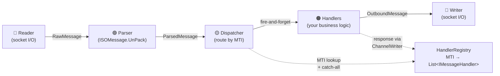
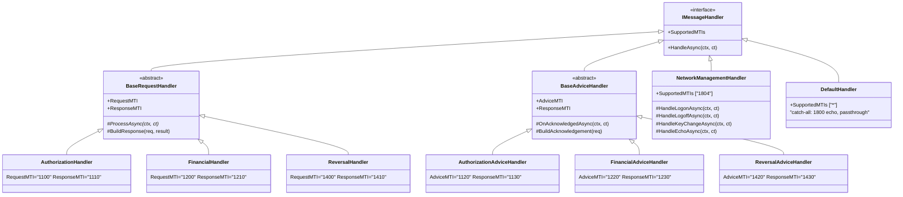
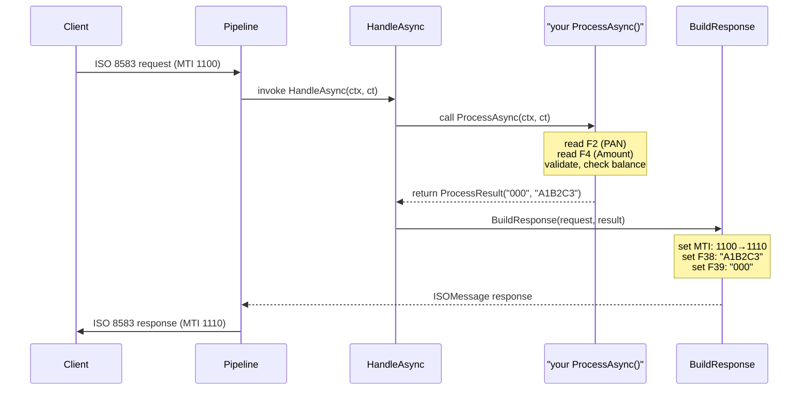
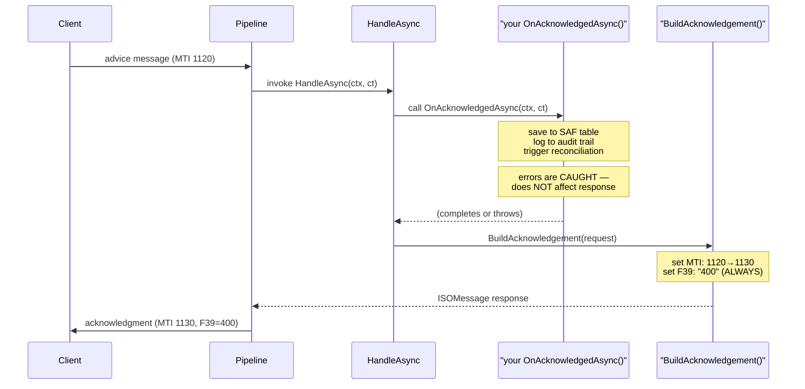

# ISO8583Service — Handler Development Guide

A practical guide to implementing business logic with ISO8583Service's
handler framework. For architecture details, see
[arch-design.md](../tools/ISO8583Service/arch-design.md).

---

## Table of Contents

1. [Architecture Overview](#architecture-overview)
2. [Quick Start](#quick-start)
3. [Handler Types Reference](#handler-types-reference)
4. [Request Handlers (BaseRequestHandler)](#request-handlers-baserequesthandler)
5. [Advice Handlers (BaseAdviceHandler)](#advice-handlers-baseadvicehandler)
6. [Network Management (NetworkManagementHandler)](#network-management-networkmanagementhandler)
7. [Low-Level Custom Handler (IMessageHandler)](#low-level-custom-handler-imessagehandler)
8. [The DefaultHandler (Catch-All)](#the-defaulthandler-catch-all)
9. [Registration & DI](#registration--di)
10. [MessageContext — Your Toolbox](#messagecontext--your-toolbox)
11. [ISO 8583 Field Quick Reference](#iso-8583-field-quick-reference)
12. [Logging](#logging)
13. [Health Checks & Monitoring](#health-checks--monitoring)
14. [Testing Handlers](#testing-handlers)
15. [Complete Walkthrough](#complete-walkthrough)

---

## Architecture Overview



Your business logic lives **only in handlers**. The pipeline handles I/O,
framing, parsing, routing, backpressure, circuit breaking, and graceful
shutdown — you never touch sockets or message framing.

### Handler Hierarchy



---

## Quick Start

### 1. Create a handler class

```csharp
// tools/ISO8583Service/Handlers/MyAuthorizationHandler.cs
using ISO8583Net.Server.Pipeline.Handlers;
using ISO8583Net.Server.Pipeline.Messages;
using Microsoft.Extensions.Logging;

namespace ISO8583Service.Handlers;

public class MyAuthorizationHandler : BaseRequestHandler
{
    public override string RequestMTI => "1100";   // what we receive
    public override string ResponseMTI => "1110";  // what we respond

    private readonly ILogger<MyAuthorizationHandler> _logger;
    private readonly ICardDatabase _cardDb;

    public MyAuthorizationHandler(
        ICardDatabase cardDb,
        ILogger<MyAuthorizationHandler> logger)
        : base(logger)
    {
        _logger = logger;
        _cardDb = cardDb;
    }

    protected override async Task<ProcessResult> ProcessAsync(
        MessageContext context, CancellationToken ct)
    {
        var pan = context.Request.GetFieldValue(2);    // card number
        var amount = context.Request.GetFieldValue(4); // transaction amount

        _logger.LogInformation("Auth request: PAN={Pan} Amount={Amount}",
            pan, amount);

        // Your business logic here
        if (!await _cardDb.IsValidAsync(pan, ct))
            return ProcessResult.Declined("100");  // do not honor

        if (decimal.Parse(amount!) > await _cardDb.GetLimitAsync(pan, ct))
            return ProcessResult.Declined("116");  // insufficient funds

        var approvalCode = Guid.NewGuid().ToString("N")[..6].ToUpper();
        return ProcessResult.Approved(approvalCode);
    }
}
```

### 2. Register it in Program.cs

```csharp
// tools/ISO8583Service/Program.cs — builder.Services section
builder.Services.AddSingleton<IMessageHandler, MyAuthorizationHandler>();
```

### 3. Register your dependencies

```csharp
// Same place in Program.cs
builder.Services.AddSingleton<ICardDatabase, SqlCardDatabase>();
```

That's it. Messages with MTI "1100" will automatically route to your handler.
No socket code, no message framing — just business logic.

---

## Handler Types Reference

### When to use what

| Situation | Use | Override method |
|-----------|-----|-----------------|
| I receive a request and must approve/decline it | `BaseRequestHandler` | `ProcessAsync()` |
| I receive a store-and-forward notification, just need to log it and ack | `BaseAdviceHandler` | `OnAcknowledgedAsync()` |
| I need to handle logon/logoff/key-change/echo | `NetworkManagementHandler` | `HandleLogonAsync()` etc. |
| I need full control (no auto-MTI, no auto-fields, raw ISOMessage manipulation) | `IMessageHandler` directly | `HandleAsync()` |
| I'm a catch-all for unknown MTIs | `DefaultHandler` — already exists | (none, already registered) |

### F39 Action Codes (Response Code)

| F39 | Meaning | When to use |
|-----|---------|-------------|
| `000` | Approved | Transaction successful |
| `085` | Not declined | Advice accepted, no issues |
| `100` | Do not honor | Card blocked, invalid, stolen |
| `116` | Insufficient funds | Balance too low for amount |
| `400` | Accepted | Advice acknowledged (auto-set by BaseAdviceHandler) |
| `902` | Invalid transaction | Parse error, bad format |
| `906` | Not supported | Feature not implemented |
| `909` | System malfunction | Internal error |

---

## Request Handlers (BaseRequestHandler)

For MTIs: **1100** (Authorization), **1200** (Financial), **1400** (Reversal).

### What it does automatically

1. **Sets response MTI** — 1100→1110, 1200→1210, 1400→1410
2. **Copies common fields** from request to response: F2 (PAN), F3 (Processing Code),
   F4 (Amount), F7 (Date/Time), F11 (STAN), F12 (Local Time), F22 (POS Entry Mode),
   F32 (Acquiring Institution), F37 (RRN), F41 (Terminal ID), F42 (Merchant ID),
   F49 (Currency Code)
3. **Sets F39** from your `ProcessResult.ActionCode`
4. **Sets F38** (Approval Code) if you provide one
5. **Catches exceptions** and responds with F39="902" (format error)

### The ProcessResult struct

```csharp
// Approved — F39="000", optional 6-char approval code
ProcessResult.Approved("A1B2C3");

// Declined — F39="100", optional 6-char approval code
ProcessResult.Declined("XYZ999");

// Format error — F39="902"
ProcessResult.FormatError();

// Custom action code
new ProcessResult("116");                    // insufficient funds
new ProcessResult("116", approvalCode: "OK1"); // with approval code
```

### Lifecycle



### Overriding BuildResponse

If you need to add custom fields to the response beyond F38/F39:

```csharp
protected override ISOMessage BuildResponse(ISOMessage request, ProcessResult result)
{
    var response = base.BuildResponse(request, result);
    response.Set(44, "MYDATA");   // Additional Response Data
    response.Set(62, "INVOICE1"); // Custom field
    return response;
}
```

---

## Advice Handlers (BaseAdviceHandler)

For MTIs: **1120** (Auth Advice), **1220** (Financial Advice), **1420** (Reversal Advice).

Advice messages are **store-and-forward notifications** — the acquirer sends a
record of a previously completed transaction. Your job is to acknowledge receipt
(F39="400") and optionally do post-processing.

### What it does automatically

1. **Sets response MTI** — 1120→1130, 1220→1230, 1420→1430
2. **Sets F39="400"** (accepted) — always
3. **Calls `OnAcknowledgedAsync()`** for your side-effects

### Lifecycle



### Example: SAF clearing

```csharp
public class MyAuthAdviceHandler : BaseAdviceHandler
{
    public override string AdviceMTI => "1120";
    public override string ResponseMTI => "1130";

    private readonly ISafRepository _safRepo;

    public MyAuthAdviceHandler(ISafRepository safRepo, ILogger<MyAuthAdviceHandler> logger)
        : base(logger) { _safRepo = safRepo; }

    protected override async Task OnAcknowledgedAsync(
        MessageContext context, CancellationToken ct)
    {
        var rrn = context.Request.GetFieldValue(37);  // RRN
        var amount = context.Request.GetFieldValue(4); // Amount
        await _safRepo.MarkAsReceivedAsync(rrn!, amount!, ct);
    }
}
```

> **Important:** `OnAcknowledgedAsync` errors are caught and logged but do NOT
> affect the response. The advice is always acknowledged with F39="400".
> If your side-effect fails, handle it internally (retry, dead-letter, alert).

---

## Network Management (NetworkManagementHandler)

Handles MTI **1804→1814**. Dispatches to virtual methods based on F24 (Function Code).

### F24 Function Codes

| F24 | Method | Default behavior | Override for |
|-----|--------|-----------------|--------------|
| `801` | `HandleLogonAsync()` | returns `"000"` | Authentication, session creation, IP allow-listing |
| `802` | `HandleLogoffAsync()` | returns `"000"` | Session cleanup, audit log |
| `811` | `HandleKeyChangeAsync()` | returns `"906"` (unsupported) | Crypto key rotation (ZMK, ZPK, TMK) |
| `831` | `HandleEchoAsync()` | returns `"000"` | Keep-alive heartbeat checks |

### Example: session-based logon

```csharp
public class SecureNetworkHandler : NetworkManagementHandler
{
    private readonly ISessionManager _sessions;

    public SecureNetworkHandler(ISessionManager sessions,
        ILogger<SecureNetworkHandler> logger) : base(logger)
    {
        _sessions = sessions;
    }

    protected override async Task<string> HandleLogonAsync(
        MessageContext context, CancellationToken ct)
    {
        string? terminalId = context.Request.GetFieldValue(41);
        await _sessions.CreateSessionAsync(terminalId!, context.ConnectionNumber, ct);
        return "000";
    }

    protected override async Task<string> HandleLogoffAsync(
        MessageContext context, CancellationToken ct)
    {
        string? terminalId = context.Request.GetFieldValue(41);
        await _sessions.DestroySessionAsync(terminalId!, ct);
        return "000";
    }
}
```

---

## Low-Level Custom Handler (IMessageHandler)

Use when you need **full control** — no auto MTI mapping, no auto field copying,
no auto F39. You receive the raw `MessageContext` and decide everything.

```csharp
public class CustomBatchHandler : IMessageHandler
{
    public IReadOnlySet<string> SupportedMTIs { get; }
        = new HashSet<string> { "0320", "0420" };

    public async Task<ISOMessage?> HandleAsync(MessageContext ctx, CancellationToken ct)
    {
        var mti = ctx.Request.GetFieldValue(0);

        if (mti == "0320")
        {
            // Manual response construction
            ctx.Request.Set(0, "0330");
            ctx.Request.Set(39, "000");
            ctx.Request.Set(60, "CUSTOM_DATA");
            return ctx.Request;
        }

        // No response
        return null;
    }
}
```

Return `null` to skip sending a response entirely.

---

## The DefaultHandler (Catch-All)

Registered with MTI `"*"` — it receives **every** message as a fallback.

### Behavior

| MTI | Action |
|-----|--------|
| `1800` | Echo: sets MTI→1814, F39="000", returns response |
| Everything else | Logs at Trace level, returns `null` (no response) |

### Important: catch-all runs alongside specific handlers

When you register `AuthorizationHandler` for MTI "1100", both your handler AND
`DefaultHandler` fire for every 1100 message. DefaultHandler returns `null` for
non-1800 MTIs, so it's a harmless no-op. The dispatcher sends whichever response
is non-null (your handler's wins).

To disable the catch-all, simply don't register `DefaultHandler` in DI.

---

## Registration & DI

### All handlers must be registered

```csharp
// tools/ISO8583Service/Program.cs

// Required infrastructure (always register these)
builder.Services.AddSingleton<HandlerRegistry>();
builder.Services.AddSingleton<PipelineHost>();

// Framework handlers
builder.Services.AddSingleton<IMessageHandler, DefaultHandler>();            // catch-all
builder.Services.AddSingleton<IMessageHandler, NetworkManagementHandler>();  // 1804

// Your business handlers
builder.Services.AddSingleton<IMessageHandler, MyAuthorizationHandler>();    // 1100
builder.Services.AddSingleton<IMessageHandler, FinancialHandler>();          // 1200
builder.Services.AddSingleton<IMessageHandler, ReversalHandler>();           // 1400

// Advice handlers (if you need side-effects)
builder.Services.AddSingleton<IMessageHandler, AuthorizationAdviceHandler>(); // 1120
builder.Services.AddSingleton<IMessageHandler, FinancialAdviceHandler>();     // 1220
builder.Services.AddSingleton<IMessageHandler, ReversalAdviceHandler>();      // 1420
```

> **Key:**

> - Use `AddSingleton` — handlers are stateless by design, shared across all connections
> - Register each handler as `IMessageHandler` — the `HandlerRegistry` scans all `IMessageHandler` registrations
> - Order doesn't matter — the registry builds an MTI lookup map

### DI in handlers — inject anything

Handlers are full DI citizens. Inject databases, HTTP clients, caches, validators:

```csharp
public class MyAuthorizationHandler : BaseRequestHandler
{
    public MyAuthorizationHandler(
        ICardDatabase cardDb,
        IFraudChecker fraud,
        HttpClient httpClient,
        IOptions<AuthOptions> options,
        ILogger<MyAuthorizationHandler> logger)
        : base(logger)
    { ... }
}
```

---

## MessageContext — Your Toolbox

```csharp
public sealed class MessageContext
{
    /// <summary>The incoming ISO 8583 message (parsed, all fields accessible).</summary>
    public ISOMessage Request { get; }

    /// <summary>Connection number (incremented per connection, unique within server lifetime).</summary>
    public int ConnectionNumber { get; }

    /// <summary>Remote IP:port string.</summary>
    public string RemoteEndpoint { get; }

    /// <summary>When the raw bytes came off the socket.</summary>
    public DateTime ReceivedAt { get; }

    /// <summary>Send a response back to the client.</summary>
    public ValueTask SendResponseAsync(ISOMessage response, CancellationToken ct);
}
```

Most handlers don't call `SendResponseAsync` directly — the base classes do that.
But it's available if you implement `IMessageHandler` directly or need to send
multiple responses for a single request.

---

## ISO 8583 Field Quick Reference

### Common fields your handler will read

| Field | Name | Format | Example |
|-------|------|--------|---------|
| 0 | MTI | n-4 | `"1100"` |
| 2 | PAN (Primary Account Number) | n..19 | `"6221061234567890"` |
| 3 | Processing Code | n-6 | `"000000"` |
| 4 | Amount, Transaction | n-12 | `"000000012500"` = 125.00 |
| 7 | Transmission Date/Time | n-10 | `"0717153000"` = Jul 17, 15:30 |
| 11 | STAN (Systems Trace Audit Number) | n-6 | `"000123"` |
| 12 | Time, Local Transaction | n-6 | `"153000"` |
| 22 | POS Entry Mode | n-3 | `"051"` |
| 24 | Function Code | n-3 | `"801"` = logon |
| 32 | Acquiring Institution ID | n..11 | `"123456"` |
| 37 | RRN (Retrieval Reference Number) | an-12 | `"123456789012"` |
| 38 | Approval Code | an-6 | `"A1B2C3"` |
| 39 | Action Code (Response Code) | n-3 | `"000"` = approved |
| 41 | Card Acceptor Terminal ID | ans-8 | `"TERM0001"` |
| 42 | Card Acceptor ID (Merchant) | ans-15 | `"MERCHANT123"` |
| 48 | Additional Data — Fixed TLV | ans..999 | (D8 dialect: Fixed-TLV) |
| 49 | Currency Code, Transaction | n-3 | `"784"` = AED |
| 55 | EMV/ICC Data — BER-TLV | ans..999 | (chip card data) |

### Reading fields

```csharp
string? pan = context.Request.GetFieldValue(2);
string? amount = context.Request.GetFieldValue(4);
string? rrn = context.Request.GetFieldValue(37);
string? functionCode = context.Request.GetFieldValue(24);
```

Fields are always `string?` — null if not present in the bitmap.

### Writing fields

```csharp
response.Set(0, "1110");          // MTI
response.Set(38, "A1B2C3");      // Approval Code
response.Set(39, "000");          // Action Code
```

---

## Logging

Serilog is configured out of the box — inject `ILogger<T>` into your handler
and it flows through structured logging automatically.

```csharp
_logger.LogInformation("Auth decision: PAN={Pan} F39={Action} Approval={AppCode}",
    pan, actionCode, approvalCode);
```

### Sinks configured in appsettings.json

| Sink | Path |
|------|------|
| Console | stdout (Docker/terminal) |
| File | `logs/iso8583-service-{date}.log`, 7-day retention |

Output format: `HH:mm:ss.fff [INF] Auth decision: PAN=... F39=000 ...`

To add more sinks (Seq, Elasticsearch, Datadog), add to the `Serilog` section
in `appsettings.json` and to the `UseSerilog()` configuration in `Program.cs`.

---

## Health Checks & Monitoring

`GET http://localhost:5000/health` returns:

```json
{
  "status": "Healthy",
  "results": {
    "pipeline": {
      "status": "Healthy",
      "description": "All systems operational",
      "data": {
        "ConnectionCount": 3,
        "IsRunning": true,
        "HandlerCount": 4,
        "TotalMessagesReceived": 12500,
        "TotalMessagesSent": 12498,
        "TotalParseErrors": 2,
        "MaxWriteQueueLength": 15,
        "MaxInFlight": 8
      }
    }
  }
}
```

### Status thresholds

| Status | Condition |
|--------|-----------|
| **Healthy** | Server running, write queue < 200 |
| **Degraded** | No connections OR write queue > 200 |
| **Unhealthy** | Server not running |

REST API status is also at `GET /iso8583/status` (legacy endpoint).

---

## Testing Handlers

Handlers are plain classes — unit-test them without any TCP infrastructure.

```csharp
[Fact]
public async Task AuthorizationHandler_DeclinesBlockedCard()
{
    // Arrange
    var cardDb = new Mock<ICardDatabase>();
    cardDb.Setup(x => x.IsValidAsync("BLOCKED_PAN", It.IsAny<CancellationToken>()))
           .ReturnsAsync(false);

    var handler = new MyAuthorizationHandler(
        cardDb.Object,
        NullLogger<MyAuthorizationHandler>.Instance);

    var request = CreateIsoMessage(pan: "BLOCKED_PAN", amount: "1000");
    var ctx = CreateMessageContext(request);

    // Act
    var response = await handler.HandleAsync(ctx, CancellationToken.None);

    // Assert
    Assert.NotNull(response);
    Assert.Equal("1110", response.GetFieldValue(0));  // correct response MTI
    Assert.Equal("100", response.GetFieldValue(39));  // declined
}
```

Helper to create a minimal ISOMessage for testing:

```csharp
private static ISOMessage CreateIsoMessage(string pan, string amount)
{
    var msg = new ISOMessage(/* your dialect/template setup */);
    msg.Set(0, "1100");
    msg.Set(2, pan);
    msg.Set(3, "000000");
    msg.Set(4, amount.PadLeft(12, '0'));
    msg.Set(7, DateTime.Now.ToString("MMddHHmmss"));
    msg.Set(11, "000123");
    msg.Set(37, "123456789012");
    msg.Set(41, "TERM0001");
    return msg;
}
```

---

## Complete Walkthrough

Here's a realistic authorization handler with a database, fraud check, and audit trail:

```csharp
public class ProductionAuthorizationHandler : BaseRequestHandler
{
    public override string RequestMTI => "1100";
    public override string ResponseMTI => "1110";

    private readonly ICardRepository _cards;
    private readonly IFraudService _fraud;
    private readonly IAuditLogger _audit;
    private readonly ILogger<ProductionAuthorizationHandler> _logger;

    public ProductionAuthorizationHandler(
        ICardRepository cards,
        IFraudService fraud,
        IAuditLogger audit,
        ILogger<ProductionAuthorizationHandler> logger)
        : base(logger)
    {
        _cards = cards;
        _fraud = fraud;
        _audit = audit;
        _logger = logger;
    }

    protected override async Task<ProcessResult> ProcessAsync(
        MessageContext ctx, CancellationToken ct)
    {
        var pan     = ctx.Request.GetFieldValue(2) ?? "";
        var amount  = ctx.Request.GetFieldValue(4) ?? "0";
        var posMode = ctx.Request.GetFieldValue(22) ?? "000";
        var stan    = ctx.Request.GetFieldValue(11) ?? "";

        // 1. Validate format
        if (pan.Length < 13)
        {
            _logger.LogWarning("Invalid PAN length: {Len}", pan.Length);
            return ProcessResult.FormatError();
        }

        // 2. Check card validity
        var card = await _cards.FindByPanAsync(pan, ct);
        if (card is null)
        {
            await _audit.LogAsync(stan, "AUTH", "DECLINED", "UNKNOWN_CARD");
            return ProcessResult.Declined("100");  // do not honor
        }

        if (card.IsBlocked)
        {
            await _audit.LogAsync(stan, "AUTH", "DECLINED", "BLOCKED_CARD");
            return ProcessResult.Declined("100");  // do not honor
        }

        // 3. Fraud check
        var fraudScore = await _fraud.EvaluateAsync(pan, posMode,
            decimal.Parse(amount) / 100, ct);
        if (fraudScore > 80)
        {
            await _audit.LogAsync(stan, "AUTH", "DECLINED", $"FRAUD:{fraudScore}");
            return ProcessResult.Declined("159");  // suspected fraud
        }

        // 4. Balance check
        var amt = decimal.Parse(amount) / 100;
        if (amt > card.AvailableBalance)
        {
            await _audit.LogAsync(stan, "AUTH", "DECLINED", "INSUFFICIENT_FUNDS");
            return ProcessResult.Declined("116");  // insufficient funds
        }

        // 5. Approval
        var approvalCode = await _cards.GenerateApprovalCodeAsync(stan, ct);
        await _audit.LogAsync(stan, "AUTH", "APPROVED", approvalCode, amt);

        _logger.LogInformation(
            "Auth approved: PAN=***{Last4} Amount={Amount} RRN={RRN} Approval={Code}",
            pan[^4..], amt, ctx.Request.GetFieldValue(37), approvalCode);

        return ProcessResult.Approved(approvalCode);
    }
}
```

Register it:

```csharp
// Program.cs
builder.Services.AddSingleton<ICardRepository, SqlCardRepository>();
builder.Services.AddSingleton<IFraudService, MlFraudService>();
builder.Services.AddSingleton<IAuditLogger, SerilogAuditLogger>();
builder.Services.AddSingleton<IMessageHandler, ProductionAuthorizationHandler>();
```

And that's it — the pipeline handles the rest.

---

## Summary

| Concept | Where |
|---------|-------|
| **Architecture doc** | `tools/ISO8583Service/arch-design.md` |
| **Base request handler** | `src/ISO8583Server/Pipeline/Handlers/BaseRequestHandler.cs` |
| **Base advice handler** | `src/ISO8583Server/Pipeline/Handlers/BaseAdviceHandler.cs` |
| **Network management** | `src/ISO8583Server/Pipeline/Handlers/NetworkManagementHandler.cs` |
| **Handler interface** | `src/ISO8583Server/Pipeline/Handlers/IMessageHandler.cs` |
| **Message context** | `src/ISO8583Server/Pipeline/Messages/MessageContext.cs` |
| **Dialect definition** | `ISODialects/d8-iso8583.json` |
| **DI registration** | `tools/ISO8583Service/Program.cs` |
| **App config** | `tools/ISO8583Service/appsettings.json` |
