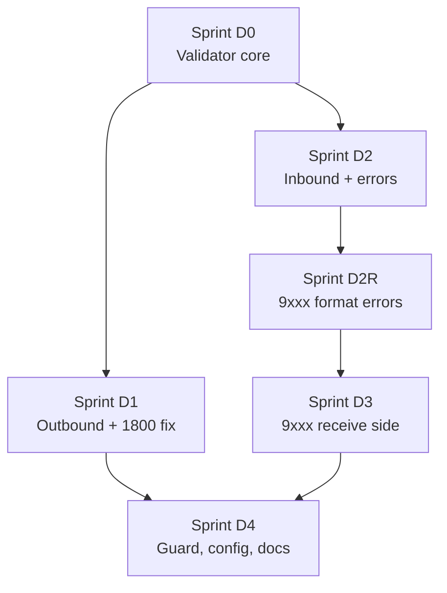

# Dialect-Enforced Validation — Sprints

Proposal and sprint plan for bounding developers/users to what is actually defined in the ISO 8583 dialect.

## Read first

- [proposal-dialect-validation.md](proposal-dialect-validation.md) — the mechanism design.
- [design-note-d8-9xxx-generalization.md](design-note-d8-9xxx-generalization.md) — why the
  `9xxx` logic is D8-specific today and how it could be generalized.

## Sprints

| Sprint | Goal | File | Status |
|--------|------|------|--------|
| D0 | Validator core (membership + participation API) | [sprint-d0-validator-core.md](sprint-d0-validator-core.md) | Done |
| D1 | Outbound enforcement + `1800`→`1804` fix | [sprint-d1-outbound-enforcement.md](sprint-d1-outbound-enforcement.md) | Done |
| D2 | Inbound enforcement + error responses | [sprint-d2-inbound-enforcement.md](sprint-d2-inbound-enforcement.md) | Done |
| D2R | Spec-complete `9xxx` format-error responses | [sprint-d2r-format-error-9xxx.md](sprint-d2r-format-error-9xxx.md) | Done |
| D3 | `9xxx` format-error responses: receive side | [sprint-d3-9xxx-receive-side.md](sprint-d3-9xxx-receive-side.md) | Done |
| D4 | Handler guard, config & docs | [sprint-d4-handler-guard-and-config.md](sprint-d4-handler-guard-and-config.md) | Done |

## Already shipped (overlaps with these sprints)

Committed in `a4ee19c`; not sprint tasks themselves, but they overlap with D1/D2:

- **D1-4** — outbound network-management MTI `1800` → `1804` (single literal in `PipelineHost.BuildRequest`).
- **D8 header** — `ProtocolId` corrected to `G2B-ISO-1.00`.
- **Field 24 interpreter** — `ISOIndexedValueInterpreter` for function codes (`801` Logon, `802` Logoff, `811` Key change, `831` Echo test, plus `100/200/400/401`).
- **Bitmap-less / header-error inbound guard** — no-throw parse, D8 header warning, and regression test (see D2).
- **Tri-state outbound validation mode** — `DialectValidationMode` (`Off`/`Warn`/`On`) on the shared packager, seeded via `ServerOptions.DialectValidationMode` and toggleable at runtime through `PUT /api/iso8583/config` (D4-3 config slice).

## Dependency order

## Tracking convention

Each sprint file uses a task table with a `Status` column:
`Not started` → `In progress` → `Done`. Mark a task `Done` only when its build/test gate passes.
