# D8 G2B Processing ISO 8583:1993 — Dialect Reference

> **Dialect file:** `d8-iso8583.json`  
> **Specification:** D8 G2B Payment Platform External Interface v1.10  
> **Header:** 21-byte ASCII (`ISOHeaderD8Packager`)  
> **Encoding:** ISO 8583:1993(E) with Fixed TLV (Field 48) and BER-TLV (Field 55)

---

## 1. Overview

This document describes the ISO 8583 message dialect used by the D8 G2B Payment Platform External Interface. The dialect follows **ISO 8583:1993(E)** and supports four message classes:

| Class | Description |
|-------|-------------|
| **1xxx** | Authorisation — approval/guarantee of funds (no posting) |
| **2xxx** | Financial — authorisation + posting + reconciliation |
| **4xxx** | Reversal — full or partial cancellation of a previous transaction |
| **8xxx** | Network Management — logon, logoff, echo test, key change |

The **Message Type Identifier (MTI)** is a 4‑digit numeric field (`n 4`, BCD) structured as:

| Position | Meaning | Values |
|----------|---------|--------|
| 1 | Version | `1` = G2B‑ISO‑1.00 |
| 2 | Message Class | `1`=Auth, `2`=Financial, `4`=Reversal, `8`=Network |
| 3 | Message Function | `0`=Request, `1`=Response, `2`=Advice, `3`=Advice Response |
| 4 | Transaction Originator | `0`=Acquirer, `2`=Card Issuer, `4`=Other |

---

## 2. Message Header (D8)

The D8 header is a 21‑byte ASCII string with fixed positions:

| Position | Field | Permitted Values |
|----------|-------|------------------|
| 1–12 | Protocol Identifier | `G2B-ISO-1.00` |
| 13–14 | Message Source | `00`=ATM, `01`=POS |
| 15–16 | Version Number | `10` |
| 17–19 | Field in Error | `000`–`128`, or `999` for header error |
| 20–21 | Reserved | `00` |

---

## 3. Message Types — Field Participation Grids

> **Legend:** `M` = Mandatory, `C` = Conditional / Optional.  
> Fields not listed are absent from that message type.

### 3.1 Authorisation Messages (1xxx)

| Fld | Name | 1100 | 1110 | 1120 | 1130 |
|-----|------|:----:|:----:|:----:|:----:|
| 0 | Message Type Identifier | M | M | M | M |
| 1 | Primary Bitmap | M | M | M | M |
| 2 | Primary Account Number (PAN) | M | M | M | M |
| 3 | Processing Code | M | M | M | M |
| 4 | Amount, Transaction | M | M | M | M |
| 6 | Amount, Cardholder Billing | C | C | C | C |
| 7 | Transmission Date and Time | M | M | M | M |
| 10 | Conversion Rate, Cardholder Billing | C | C | C | C |
| 11 | Systems Trace Audit Number | M | M | M | M |
| 12 | Date and Time, Local Transaction | M | M | M | M |
| 14 | Date, Expiration | C | C | M | C |
| 15 | Date, Settlement | C | C | C | C |
| 16 | Date, Conversion | C | C | C | C |
| 19 | Acquiring Institution Country Code | — | — | M | M |
| 20 | Country Code, PAN | C | C | C | C |
| 21 | Country Code, Forwarding Institution | C | — | C | — |
| 22 | Point Of Service Data Code | M | — | M | M |
| 23 | Card Sequence Number | C | — | C | C |
| 24 | Function Code | M | — | M | M |
| 26 | Card Acceptor Business Type | M | — | M | M |
| 28 | Date, Reconciliation | M | M | M | M |
| 32 | Acquiring Institution Identification Code | M | M | M | M |
| 33 | Forwarding Institution Identification Code | C | — | C | — |
| 35 | Track 2 Data | C | C | C | C |
| 37 | Retrieval Reference Number | M | M | M | M |
| 38 | Approval Code | — | M | — | M |
| 39 | Action Code | — | C | — | C |
| 40 | Service Code | — | C | — | C |
| 41 | Card Acceptor Terminal Identification | M | M | M | M |
| 42 | Card Acceptor Identification Code | M | M | M | M |
| 43 | Card Acceptor Name/Location | C | — | C | — |
| 44 | Additional Response Data | — | C | — | C |
| 45 | Track 1 Data | C | C | C | C |
| 46 | Amount, Fees | C | — | C | — |
| 48 | Additional Data, Private | C | C | C | C |
| 49 | Currency Code, Transaction | M | M | M | M |
| 51 | Currency Code, Cardholder Billing | C | C | C | C |
| 52 | PIN Data | C | — | C | — |
| 53 | Security Related Control Information | C | — | C | — |
| 54 | Additional Amounts | C | C | C | C |
| 55 | ICC System Related Data | C | C | C | C |
| 102 | Account Identification 1 | C | C | C | C |
| 103 | Account Identification 2 | C | C | C | C |

---

### 3.2 Financial Messages (2xxx)

| Fld | Name | 1200 | 1210 | 1220 | 1230 |
|-----|------|:----:|:----:|:----:|:----:|
| 0 | Message Type Identifier | M | M | M | M |
| 1 | Primary Bitmap | M | M | M | M |
| 2 | Primary Account Number (PAN) | M | M | M | M |
| 3 | Processing Code | M | M | M | M |
| 4 | Amount, Transaction | M | M | M | M |
| 6 | Amount, Cardholder Billing | C | C | C | C |
| 7 | Transmission Date and Time | M | M | M | M |
| 10 | Conversion Rate, Cardholder Billing | C | C | C | C |
| 11 | Systems Trace Audit Number | M | M | M | M |
| 12 | Date and Time, Local Transaction | M | M | M | M |
| 14 | Date, Expiration | C | C | M | C |
| 15 | Date, Settlement | C | C | C | C |
| 16 | Date, Conversion | C | C | C | C |
| 19 | Acquiring Institution Country Code | M | M | M | M |
| 20 | Country Code, PAN | C | C | C | C |
| 21 | Country Code, Forwarding Institution | C | — | C | — |
| 22 | Point Of Service Data Code | M | — | M | — |
| 23 | Card Sequence Number | C | — | C | — |
| 24 | Function Code | M | — | M | — |
| 26 | Card Acceptor Business Type | M | — | M | — |
| 28 | Date, Reconciliation | M | M | M | M |
| 32 | Acquiring Institution Identification Code | M | M | M | M |
| 33 | Forwarding Institution Identification Code | C | — | C | — |
| 35 | Track 2 Data | C | C | C | C |
| 37 | Retrieval Reference Number | M | M | M | M |
| 38 | Approval Code | — | M | — | M |
| 39 | Action Code | — | C | — | C |
| 40 | Service Code | — | C | — | C |
| 41 | Card Acceptor Terminal Identification | M | M | M | M |
| 42 | Card Acceptor Identification Code | M | M | M | M |
| 43 | Card Acceptor Name/Location | C | — | C | — |
| 44 | Additional Response Data | — | — | — | C |
| 45 | Track 1 Data | C | C | C | C |
| 46 | Amount, Fees | C | — | C | — |
| 48 | Additional Data, Private | C | C | C | C |
| 49 | Currency Code, Transaction | M | M | M | M |
| 51 | Currency Code, Cardholder Billing | C | C | C | C |
| 52 | PIN Data | C | — | C | — |
| 53 | Security Related Control Information | C | — | C | — |
| 54 | Additional Amounts | C | C | C | C |
| 55 | ICC System Related Data | C | C | C | C |
| 56 | Original Data Elements | C | — | C | — |
| 102 | Account Identification 1 | C | C | C | C |
| 103 | Account Identification 2 | C | C | C | C |

---

### 3.3 Reversal Messages (4xxx)

| Fld | Name | 1400 | 1410 | 1420 | 1430 |
|-----|------|:----:|:----:|:----:|:----:|
| 0 | Message Type Identifier | M | M | M | M |
| 1 | Primary Bitmap | M | M | M | M |
| 2 | Primary Account Number (PAN) | M | M | M | M |
| 3 | Processing Code | M | M | M | M |
| 4 | Amount, Transaction | M | M | M | M |
| 6 | Amount, Cardholder Billing | C | C | C | C |
| 7 | Transmission Date and Time | M | M | M | M |
| 10 | Conversion Rate, Cardholder Billing | C | C | C | C |
| 11 | Systems Trace Audit Number | M | M | M | M |
| 12 | Date and Time, Local Transaction | C | C | M | M |
| 14 | Date, Expiration | C | C | C | C |
| 15 | Date, Settlement | — | — | C | C |
| 16 | Date, Conversion | — | — | C | C |
| 19 | Acquiring Institution Country Code | M | M | M | M |
| 20 | Country Code, PAN | C | C | C | C |
| 21 | Country Code, Forwarding Institution | C | — | C | — |
| 22 | Point Of Service Data Code | C | — | C | — |
| 23 | Card Sequence Number | C | — | C | — |
| 24 | Function Code | M | — | M | — |
| 25 | Message Reason Code | C | — | **M** | — |
| 26 | Card Acceptor Business Type | C | — | C | — |
| 28 | Date, Reconciliation | M | M | M | M |
| 30 | Amount, Original | M | M | M | M |
| 32 | Acquiring Institution Identification Code | M¹ | M¹ | M¹ | M¹ |
| 33 | Forwarding Institution Identification Code | C | — | C | — |
| 37 | Retrieval Reference Number | M¹ | M¹ | M¹ | M¹ |
| 38 | Approval Code | C | C | C | M |
| 39 | Action Code | — | C | — | C |
| 40 | Service Code | C | C | C | C |
| 41 | Card Acceptor Terminal Identification | M | M | C | C |
| 42 | Card Acceptor Identification Code | M | M | C | C |
| 43 | Card Acceptor Name/Location | C | — | C | — |
| 48 | Additional Data, Private | C | C | C | C |
| 49 | Currency Code, Transaction | M | M | M | M |
| 51 | Currency Code, Cardholder Billing | C | C | C | C |
| 55 | ICC System Related Data | C | C | C | C |
| 56 | Original Data Elements | **M** | **M** | **M** | **M** |
| 102 | Account Identification 1 | C | C | C | C |
| 103 | Account Identification 2 | C | C | C | C |

> ¹ **Key field for reversal matching** — value must match the original 1100/1200 request.

---

### 3.4 Network Management Messages (8xxx)

| Fld | Name | 1804 | 1814 |
|-----|------|:----:|:----:|
| 0 | Message Type Identifier | M | M |
| 1 | Primary Bitmap | M | M |
| 7 | Transmission Date and Time | M | M |
| 11 | Systems Trace Audit Number | M | M |
| 24 | Function Code | M | M |
| 28 | Date, Reconciliation | M | M |
| 39 | Action Code | — | M |
| 41 | Card Acceptor Terminal Identification | C | C |
| 47 | Additional Data, National | C¹ | — |

> ¹ Mandatory for key change (`Function Code = 811`). Must **not** be present for TPK key change.

### 3.5 Function Codes (Field 24) by Message Class

| Code | Description | Used In |
|------|-------------|---------|
| 100 | Original authorisation | 1100 |
| 200 | Original financial | 1200, 1220 |
| 400 | Full reversal | 1400, 1420 |
| 401 | Partial reversal | 1400, 1420 |
| 801 | Logon | 1804 |
| 802 | Logoff | 1804 |
| 811 | Key change | 1804 |
| 831 | Echo test | 1804 |

---

## 4. Field Formats — Complete Reference

### 4.1 Encoding Legend

| JSON `contentFormat` | Meaning |
|----------------------|---------|
| `N` | Numeric digits only (0–9), BCD encoded |
| `AN` | Alphanumeric (A–Z, 0–9), ASCII encoded |
| `ANS` | Alphanumeric + Special chars, ASCII encoded |
| `HD` | Hexadecimal digits (0–9, A–F), binary encoded |
| `Z` | Track 2 data, nibble-packed |
| `B` | Raw binary data |

| JSON `contentCoding` | Meaning |
|----------------------|---------|
| `BCD` | Binary Coded Decimal — 2 digits per byte, right-justified, leading zeroes |
| `ASCII` | ASCII text — left-justified, trailing spaces (`0x20`) |
| `BIN` | Raw binary bytes |
| `Z` | Track 2 nibble encoding; field separator `=` coded as hex `D` |
| `BCH` | Binary Coded Hexadecimal — like BCD but `A`–`F` permitted (used for PIN) |

| JSON `lengthFormat` | Meaning |
|---------------------|---------|
| `FIXED` | Fixed length, no length indicator prefix |
| `VAR` | Variable length, prefixed by `lengthLength` bytes |

---

### 4.2 Field Definitions

#### Field 0 — Message Type Identifier (MTI)

| Property | Value |
|----------|-------|
| Format | `n 4` |
| Length | Fixed, 4 digits (2 bytes) |
| Content | `N` / `BCD` |
| Description | 4‑digit numeric: Version(1)=1, Class(1)=1\|2\|4\|8, Function(1)=0\|1\|2\|3, Origin(1)=0\|2\|4 |

#### Field 1 — Primary Bitmap

| Property | Value |
|----------|-------|
| Format | `b 16` (8 bytes) |
| Length | Fixed, 16 hex digits |
| Content | `HD` / `BIN` |
| Storage | `Field.ISOFieldBitmap` |
| Description | 64‑bit primary bitmap. Bit 1 = presence of field 1, … Bit 64 = presence of field 64. Bit 1 = `1` indicates secondary bitmap is present. |

#### Field 2 — Primary Account Number (PAN)

| Property | Value |
|----------|-------|
| Format | `n..19 LLVAR` (or `ans..19 LLVAR` for Virtual PAN) |
| Length | Variable, 1‑byte length prefix + up to 19 digits |
| Content | `N` / `BCD` (or `ANS` / `ASCII` for Virtual PAN) |
| Description | Customer account identifier. For Cash‑to‑Card / Account‑to‑Card transfers (`DE48.C021=02,04`): use dummy value of 16 zeroes. |

#### Field 3 — Processing Code

| Property | Value |
|----------|-------|
| Format | `n 6` |
| Length | Fixed, 6 digits (3 bytes) |
| Content | `N` / `BCD` |
| Interpreter | `ISOIndexedValueInterpreter` with 3 indexed subfields |

**Subfield breakdown:**

| Position | Length | Name | Values |
|----------|--------|------|--------|
| 1–2 | 2 | Transaction Type | `00`=Goods/Services, `01`=Withdrawal, `09`=Goods+ Cash, `10`=Non‑cash, `11`=Quasi‑cash, `17`=Goods+Tip, `20`=Refund, `21`=Deposits, `26`=Funds Transfer, `31`=Balance Enquiry, `38`=Mini‑statement, `40`=A2A Transfer, `47`=Money Transfer, `50`=Bill Payment, `90`=PIN Change, `93`=Customer Auth, `94`=PIN Unblock, `95`=App Unblock, `96`=AVS Only |
| 3–4 | 2 | From Account | `00`=Default, `10`=Savings, `20`=Cheque, `30`=Credit |
| 5–6 | 2 | To Account | `00`=Default, `10`=Savings, `20`=Cheque, `30`=Credit |

#### Field 4 — Amount, Transaction

| Property | Value |
|----------|-------|
| Format | `n 12` |
| Length | Fixed, 12 digits (6 bytes) |
| Content | `N` / `BCD` |
| Description | Transaction amount in acquirer's local currency. No decimal point — implied by Field 49 currency. Zero‑filled for balance enquiries. For Money Transfer (txn 47): contains Acquirer Fee. |

#### Field 5 — Amount, Settlement

| Property | Value |
|----------|-------|
| Format | `n 12` |
| Length | Fixed, 12 digits (6 bytes) |
| Content | `N` / `BCD` |
| Description | Field 4 converted to settlement currency. Decimal implied by Field 50. Used in 1210/1230 responses (VISA SMS). |

#### Field 6 — Amount, Cardholder Billing

| Property | Value |
|----------|-------|
| Format | `n 12` |
| Length | Fixed, 12 digits (6 bytes) |
| Content | `N` / `BCD` |
| Description | Amount in cardholder's account currency (exclusive of fees). Must be inserted together with Fields 10 and 51. |

#### Field 7 — Transmission Date and Time

| Property | Value |
|----------|-------|
| Format | `n 10` (`MMDDhhmmss`) |
| Length | Fixed, 10 digits (5 bytes) |
| Content | `N` / `BCD` |
| Description | UTC date/time the message was generated (ISO 8601). Set for each outgoing message. |

#### Field 10 — Conversion Rate, Cardholder Billing

| Property | Value |
|----------|-------|
| Format | `n 8` |
| Length | Fixed, 8 digits (4 bytes) |
| Content | `N` / `BCD` |
| Description | Leftmost digit = number of decimal places in rate; remaining 7 = rate. Example: `69972522` = rate 9.972522. Must be inserted together with Fields 6 and 51. |

#### Field 11 — Systems Trace Audit Number (STAN)

| Property | Value |
|----------|-------|
| Format | `n 6` |
| Length | Fixed, 6 digits (3 bytes) |
| Content | `N` / `BCD` |
| Description | Uniquely identifies a transaction. Incremented by 1 for each new request. Not reset for ≥ 3 business days. **Key field** for matching requests/responses. |

#### Field 12 — Date and Time, Local Transaction

| Property | Value |
|----------|-------|
| Format | `n 12` (`YYMMDDhhmmss`) |
| Length | Fixed, 12 digits (6 bytes) |
| Content | `N` / `BCD` |
| Description | Local date/time at point of card acceptance — **not** UTC. **Key field** for matching. |

#### Field 14 — Date, Expiration

| Property | Value |
|----------|-------|
| Format | `n 4` (`YYMM`) |
| Length | Fixed, 4 digits (2 bytes) |
| Content | `N` / `BCD` |
| Description | PAN expiration date. May be omitted if included in Track 1/2 data. For card‑less transactions: dummy value `0101`. |

#### Field 15 — Date, Settlement

| Property | Value |
|----------|-------|
| Format | `n 6` (`YYMMDD`) |
| Length | Fixed, 6 digits (3 bytes) |
| Content | `N` / `BCD` |
| Description | Date this message becomes part of settlement. Primarily VISA SMS 1210/1230, 1410/1430. |

#### Field 16 — Date, Conversion

| Property | Value |
|----------|-------|
| Format | `n 4` (`MMDD`) |
| Length | Fixed, 4 digits (2 bytes) |
| Content | `N` / `BCD` |
| Description | Month/day used to convert from local to issuer currency. VISA 1210/1230 and Europay. |

#### Field 19 — Acquiring Institution Country Code

| Property | Value |
|----------|-------|
| Format | `n 3` |
| Length | Fixed, 3 digits (2 bytes) |
| Content | `N` / `BCD` |
| Description | ISO 3166‑1 numeric country code of the acquiring institution. |

#### Field 20 — Country Code, Primary Account Number

| Property | Value |
|----------|-------|
| Format | `n 3` |
| Length | Fixed, 3 digits (2 bytes) |
| Content | `N` / `BCD` |
| Description | Country of card issuer. Used when PAN (Field 2) begins with `59`. |

#### Field 21 — Country Code, Forwarding Institution

| Property | Value |
|----------|-------|
| Format | `n 3` |
| Length | Fixed, 3 digits (2 bytes) |
| Content | `N` / `BCD` |
| Description | Country of forwarding institution. Used when Field 33 begins with `59`. Primarily VISA SMS. |

#### Field 22 — Point Of Service Data Code

| Property | Value |
|----------|-------|
| Format | `an 12` |
| Length | Fixed, 12 ASCII characters |
| Content | `AN` / `ASCII`, right‑padded with trailing spaces |

**Subfield positions:**

| Pos | Len | Name | Selected Values |
|-----|-----|------|-----------------|
| 1 | 1 | Card Data Input Capability | `0`=Unknown, `1`=Manual, `2`=MagStripe, `5`=ICC, `6`=KeyEntry, `7`=ContactlessICC, `8`=ContactlessMSR, `A`–`D`=Contactless variants |
| 2 | 1 | Cardholder Auth Capability | `0`=None, `1`=PIN, `2`=ElectronicSig, `5`=Inoperative, `S`=3D‑Secure |
| 3 | 1 | Card Capture Capability | `0`=None, `1`=Capture possible |
| 4 | 1 | Operating Environment | `0`=NoTerminal, `1`=OnPremisesAttended, `2`=OnPremisesUnattended, `3`=OffPremisesAttended, `4`=OffPremisesUnattended, `5`=CardholderPremises |
| 5 | 1 | Cardholder Present | `0`=Present, `1`=NotPresent, `2`=MailOrder, `3`=Phone, `4`=StandingAuth, `5`=E‑commerce |
| 6 | 1 | Card Present | `0`=NotPresent, `1`=Present |
| 7 | 1 | Card Data Input Method | `0`=Unspecified, `1`=Manual, `2`=MagStripe, `5`=ContactICC, `6`=KeyEntry, `7`=ContactlessICC, `E`=ContactlessMSR, `S`/`T`=SET/3DS, `Z`=G2B‑generated |
| 8 | 1 | Cardholder Auth Method | `0`=NotAuth, `1`=PIN, `2`=ElectronicSig, `5`=ManualSig, `S`/`T`=3DS/3DS+ICC |
| 9–12 | 4 | Unused | Always `0` |

#### Field 23 — Card Sequence Number

| Property | Value |
|----------|-------|
| Format | `n 3` |
| Length | Fixed, 3 digits (2 bytes) |
| Content | `N` / `BCD` |
| Description | Differentiates cards with same PAN. EMV only. Omitted for card‑less transactions. |

#### Field 24 — Function Code

| Property | Value |
|----------|-------|
| Format | `n 3` |
| Length | Fixed, 3 digits (2 bytes) |
| Content | `N` / `BCD` |
| Description | `100`=Original auth, `200`=Original financial, `400`=Full reversal, `401`=Partial reversal, `801`=Logon, `802`=Logoff, `811`=Key change, `831`=Echo test. |

#### Field 25 — Message Reason Code

| Property | Value |
|----------|-------|
| Format | `n 4` |
| Length | Fixed, 4 digits (2 bytes) |
| Content | `N` / `BCD` |
| Description | Required in all reversal messages. `4000`=Customer cancel, `4001`=Unspecified, `4002`=Suspected malfunction, `4003`=Format error, `4004`=Completed partially, `4005`=Original amount incorrect, `4006`=Response too late, `4007`=Device unable, `4013`=Undeliverable, `4014`=Malfunction/card retained, `4018`=Timed out (no cash), `4019`=Timed out (card retained), `4020`=Invalid response, `4021`=Timeout waiting. |

#### Field 26 — Card Acceptor Business Type

| Property | Value |
|----------|-------|
| Format | `n 4` |
| Length | Fixed, 4 digits (2 bytes) |
| Content | `N` / `BCD` |
| Description | Merchant Category Code (MCC). Must be `6011` for all ATM transactions. |

#### Field 27 — Approval Code Length

| Property | Value |
|----------|-------|
| Format | `n 1` |
| Length | Fixed, 1 digit |
| Content | `N` / `BCD` |
| Description | Max approval code length acquirer can handle (1–5). Europay only. |

#### Field 28 — Date, Reconciliation

| Property | Value |
|----------|-------|
| Format | `n 6` (`YYMMDD`) |
| Length | Fixed, 6 digits (3 bytes) |
| Content | `N` / `BCD` |
| Description | Date for financial total reconciliation. Added by G2B Processing to responses. |

#### Field 30 — Amount, Original

| Property | Value |
|----------|-------|
| Format | `n 12` |
| Length | Fixed, 12 digits (6 bytes) |
| Content | `N` / `BCD` |
| Description | Original transaction amount being reversed. Must match Field 4 in original 1100/1200. |

#### Field 32 — Acquiring Institution Identification Code

| Property | Value |
|----------|-------|
| Format | `n..11 LLVAR` |
| Length | Variable, 1‑byte length + up to 11 digits |
| Content | `N` / `BCD` |
| Description | Code identifying acquiring institution. **Key field** for reversal matching. Used with Field 47 to identify Acquirer Working Key (AWK). |

#### Field 33 — Forwarding Institution Identification Code

| Property | Value |
|----------|-------|
| Format | `n..11 LLVAR` |
| Length | Variable, 1‑byte length + up to 11 digits |
| Content | `N` / `BCD` |
| Description | Code identifying forwarding institution. Primarily VISA. |

#### Field 35 — Track 2 Data

| Property | Value |
|----------|-------|
| Format | `z..37 LLVAR` |
| Length | Variable, 1‑byte length + up to 37 nibble‑packed chars |
| Content | `Z` / `Z` |
| Description | Track 2 magnetic stripe data per ISO 7813. Excluding start/end sentinels and LRC. Nibble‑packed BCD; field separator `=` is hex `D`. If odd length, leading `0` nibble prefixed. For ICC: from Track 2 Equivalent Data on chip. |

#### Field 37 — Retrieval Reference Number (RRN)

| Property | Value |
|----------|-------|
| Format | `an 12` |
| Length | Fixed, 12 ASCII characters |
| Content | `AN` / `ASCII` |
| Description | Usual format: `[1‑4]` = Julian date (`yddd`), `[5‑6]` = hour, `[7‑12]` = STAN. Europay acquirer: `[1‑7]` = `MMDD` + discretionary, `[8‑12]` = terminal transaction number. **Key field** for reversal matching. |

#### Field 38 — Approval Code

| Property | Value |
|----------|-------|
| Format | `anp 6` |
| Length | Fixed, 6 ASCII characters |
| Content | `AN` / `ASCII`, right‑padded |
| Description | Code assigned by authorising institution. All spaces or all zeroes forbidden. |

#### Field 39 — Action Code

| Property | Value |
|----------|-------|
| Format | `n 3` |
| Length | Fixed, 3 digits (2 bytes) |
| Content | `N` / `BCD` |
| Description | Action taken / reason. `000`=Approved, `085`=Not declined, `100`=Do not honor, `400`=Accepted (reversal completed), `9xx`=Format error. See Appendix C of spec for full list. |

#### Field 40 — Service Code

| Property | Value |
|----------|-------|
| Format | `n 3` |
| Length | Fixed, 3 digits (2 bytes) |
| Content | `N` / `BCD` |
| Description | Geographic/service availability (ISO 7813). Should not be present if Track 1 or 2 data is present. |

#### Field 41 — Card Acceptor Terminal Identification

| Property | Value |
|----------|-------|
| Format | `ans 8` |
| Length | Fixed, 8 ASCII characters |
| Content | `ANS` / `ASCII`, right‑padded |
| Description | Unique terminal code. Used with Field 42 for unique terminal identification. |

#### Field 42 — Card Acceptor Identification Code

| Property | Value |
|----------|-------|
| Format | `ans 15` |
| Length | Fixed, 15 ASCII characters |
| Content | `ANS` / `ASCII`, right‑padded |
| Description | Acquirer‑assigned merchant code. ATM: bank name. POS: conditional for auth, mandatory otherwise. |

#### Field 43 — Card Acceptor Name/Location

| Property | Value |
|----------|-------|
| Format | `ans..99 LLVAR` |
| Length | Variable, 1‑byte length + up to 99 ASCII chars |
| Content | `ANS` / `ASCII`, right‑padded |
| Description | **Format 0** (default): `[1‑25]` location, `[26‑38]` city, `[39‑40]` country (alpha). **Format 1**: `Name~Street~City~Postcode+Region+Country`. |

#### Field 44 — Additional Response Data

| Property | Value |
|----------|-------|
| Format | `ans..999 LLLVAR` |
| Length | Variable, 2‑byte length + up to 999 ASCII chars |
| Content | `ANS` / `ASCII`, right‑padded |
| Description | Response data. Currently used for ministatement print data. |

#### Field 45 — Track 1 Data

| Property | Value |
|----------|-------|
| Format | `ans..76 LLVAR` |
| Length | Variable, 1‑byte length + up to 76 ASCII chars |
| Content | `ANS` / `ASCII`, right‑padded |
| Description | Track 1 magnetic stripe data per ISO 7813. Excluding start/end sentinels and LRC. Omitted for card‑less transactions. |

#### Field 46 — Amount, Fees

| Property | Value |
|----------|-------|
| Format | `ans..204 LLLVAR` |
| Length | Variable, 2‑byte length + up to 204 bytes |
| Content | `ANS` / `ASCII`, right‑padded |
| Description | Up to 6 fee blocks of 34 chars each: `[1‑2]` FeeType (`00`=TxnFee), `[3‑5]` Currency, `[6]` Sign (`C`/`D`), `[7‑14]` Amount (n8), `[15‑22]` ConversionRate (unused), `[23‑31]` ReconFee (unused), `[32‑34]` ReconCurrency (unused). Currently only one fee type supported. For Money Transfer (txn 47): contains Acquirer Fee. |

#### Field 47 — Additional Data, National

| Property | Value |
|----------|-------|
| Format | `ans..999 LLLVAR` |
| Length | Variable, 2‑byte length + up to 999 ASCII chars |
| Content | `ANS` / `ASCII`, right‑padded |
| Description | National use data. Mandatory in 1804 key change. Subfields: `[1‑16]` SingleLengthKey (16 hex, spaces if double), `[17‑20]` CheckDigits, `[21]` CheckType (`1`=AWK, `2`=IWK), `[22‑23]` KeySequence (`01`–`03`), `[24‑55]` DoubleLengthKey (32 hex, absent if single). Must NOT be present for TPK key change request. |

#### Field 48 — Additional Data, Private

| Property | Value |
|----------|-------|
| Format | `b..999 LLLVAR` |
| Length | Variable, 2‑byte length + up to 999 bytes |
| Content | `AN` / `BIN` |
| Description | Private use data. Uses **Fixed TLV (Format 2)**: 2‑byte tag, 1‑byte length, variable data. See §5 below for subfield catalog. |

#### Field 49 — Currency Code, Transaction

| Property | Value |
|----------|-------|
| Format | `n 3` |
| Length | Fixed, 3 digits (2 bytes) |
| Content | `N` / `BCD` |
| Description | ISO 4217 numeric currency code (e.g. `840`=USD, `978`=EUR, `826`=GBP). Determines decimal place for monetary amounts. |

#### Field 50 — Currency Code, Reconciliation

| Property | Value |
|----------|-------|
| Format | `n 3` |
| Length | Fixed, 3 digits (2 bytes) |
| Content | `N` / `BCD` |

#### Field 51 — Currency Code, Cardholder Billing

| Property | Value |
|----------|-------|
| Format | `n 3` |
| Length | Fixed, 3 digits (2 bytes) |
| Content | `N` / `BCD` |
| Description | Cardholder account currency. Must be inserted together with Fields 6 and 10. |

#### Field 52 — PIN Data

| Property | Value |
|----------|-------|
| Format | `b 8` (8 bytes) |
| Length | Fixed, 16 hex digits (8 bytes) |
| Content | `HD` / `BIN` |
| Description | PIN block, BCH encoded (Binary Coded Hexadecimal — BCD + `A`–`F` permitted). Omitted for card‑less transactions. |

#### Field 53 — Security Related Control Information

| Property | Value |
|----------|-------|
| Format | `n..48 LLVAR` |
| Length | Variable, 1‑byte length + up to 48 digits |
| Content | `N` / `BCD` |

#### Field 54 — Additional Amounts

| Property | Value |
|----------|-------|
| Format | `ans..120 LLLVAR` |
| Length | Variable, 2‑byte length + up to 120 ASCII chars |
| Content | `ANS` / `ASCII`, right‑padded |

#### Field 55 — ICC System Related Data

| Property | Value |
|----------|-------|
| Format | `b..999 LLLVAR` |
| Length | Variable, 2‑byte length + up to 999 bytes |
| Content | `AN` / `BIN` |
| Description | EMV chip data using **BER‑TLV encoding** (variable‑length tag + variable‑length length + data). Contains standard EMV tags. See §6 for BER‑TLV tag reference. Omitted for card‑less transactions. |

#### Field 56 — Original Data Elements

| Property | Value |
|----------|-------|
| Format | `n..35 LLVAR` |
| Length | Variable, 1‑byte length + up to 35 digits |
| Content | `N` / `BCD` |
| Description | Original values of key fields (11, 12, 32, 37) when they differ in the reversal. Mandatory in all reversal messages. |

#### Field 100 — Receiving Institution Identification Code

| Property | Value |
|----------|-------|
| Format | `n..11 LLVAR` |
| Length | Variable, 1‑byte length + up to 11 digits |
| Content | `N` / `BCD` |

#### Field 102 — Account Identification 1

| Property | Value |
|----------|-------|
| Format | `ans..28 LLVAR` |
| Length | Variable, 1‑byte length + up to 28 ASCII chars |
| Content | `ANS` / `ASCII`, right‑padded |
| Description | Source account identifier for transfers. |

#### Field 103 — Account Identification 2

| Property | Value |
|----------|-------|
| Format | `ans..28 LLVAR` |
| Length | Variable, 1‑byte length + up to 28 ASCII chars |
| Content | `ANS` / `ASCII`, right‑padded |
| Description | Destination account identifier for transfers. |

#### Field 125 — New PIN Data

| Property | Value |
|----------|-------|
| Format | `b 8` (8 bytes) |
| Length | Fixed, 16 hex digits (8 bytes) |
| Content | `HD` / `BIN` |
| Description | New PIN block for PIN change transactions. BCH encoded. |

---

## 5. Field 48 — Fixed TLV Subfield Catalog

Field 48 uses **Fixed TLV (Format 2)**: each subfield has a 2‑byte tag, a 1‑byte length, and variable data.

### 5.1 Card Validation

| PDS Tag | Name | Format | Len (bytes) |
|---------|------|--------|-------------|
| `0087` | CVC Invalid Flag | `an 1` | 1 |
| `0092` | Card Verification Code (CVC) | `an 3` | 3 |

**0087 Values:** `Y`=CVV incorrect, `M`=CVC correct, `N`=CVC incorrect, `P`=Not performed, `U`=Unregistered, `S`=Should be in card but not (VISA).

### 5.2 SET / 3D‑Secure

| PDS Tag | Name | Format | Len (bytes) |
|---------|------|--------|-------------|
| `C001` | Cardholder Certificate Serial Number | `an..32` | ≤32 |
| `C002` | Merchant Certificate Serial Number | `an..32` | ≤32 |
| `C003` | Transaction ID | `an 40` | 40 |
| `C004` | TransStain / CAVV | `an 40` | 40 |

### 5.3 EMV Additional Data

| PDS Tag | Name | Format | Len (bytes) |
|---------|------|--------|-------------|
| `C005` | Additional Response Data | `ans..4` | ≤4 |
| `C006` | ICC Issuer Script Results | `b..20` | ≤20 |
| `C007` | ICC Additional POS Information | `an 3` | 3 |
| `C008` | ICC Card Authentication Results Code | `an 1` | 1 |
| `C009` | Terminal Type | `n 1` | 1 |

### 5.4 Institution / Amount / POS

| PDS Tag | Name | Format | Len (bytes) |
|---------|------|--------|-------------|
| `C00A` | Issuing Institution ID Code | `an..11` | ≤11 |
| `C00B` | Other Amount, Transaction | `n 12` | 6 |
| `C00C` | Other Amount, Cardholder Billing | `n 12` | 6 |
| `C00D` | Other Amount, Replacement Billing | `n 12` | 6 |
| `C00E` | Replacement Amounts | `n 42` | 21 |
| `C00F` | Original Forwarding Institution ID | `an..11` | ≤11 |
| `C010` | POS Condition Code | `n 2` | 1 |
| `C011` | PIN Capture Code | `an 1` | 1 |

### 5.5 Transaction Identifiers

| PDS Tag | Name | Format | Len (bytes) |
|---------|------|--------|-------------|
| `C012` | UCAF Indicator | `an 1` | 1 |
| `C013` | UCAF | `an 32` | 32 |
| `C017` | G2B Processing TLID | `n..10` | ≤10 |
| `C018` | Virtual Primary Account Number | `ans..19` | ≤19 |
| `C022` | Transaction Authorisation Indicator | `n 1` | 1 |

### 5.6 Address Verification / Customer Auth

| PDS Tag | Name | Format | Len (bytes) |
|---------|------|--------|-------------|
| `C014` | Address Verification — Postal Code | `ans..12` | ≤12 |
| `C015` | Address Verification — Street Address | `ans..43` | ≤43 |
| `C016` | Customer Authentication — Customer Code | `ans..8` | ≤8 |

### 5.7 Money Transfer Data (C019–C066)

| PDS Tag | Name | Format | Len (bytes) |
|---------|------|--------|-------------|
| `C019` | Sender Reference Number | `ans..64` | ≤64 |
| `C01A` | Sender Account Number | `ans..50` | ≤50 |
| `C01B` | Sender First Name | `ans..35` | ≤35 |
| `C01C` | Sender Address | `ans..35` | ≤35 |
| `C01D` | Sender City | `ans..25` | ≤25 |
| `C01E` | Sender State | `ans..3` | ≤3 |
| `C01F` | Sender Country | `n 3` | 2 |
| `C020` | Sender Additional Data | `ans..50` | ≤50 |
| `C021` | G2B Processing Transaction Sub‑category Code | `n 2` | 2 |
| `C023` | Sender Postal Code | `an..10` | ≤10 |
| `C024` | Recipient PAN | `an..19` | ≤19 |
| `C025` | Sender Telephone Number | `an..20` | ≤20 |
| `C026` | Sender Date of Birth | `n 8` | 8 |
| `C027` | Optional Message | `an..37` | ≤37 |
| `C028` | Recipient First Name | `an..30` | ≤30 |
| `C029` | Sender Sanction Screening Score | `n..3` | ≤3 |
| `C060` | Business Application Identifier | `as 3` | 3 |
| `C061` | Funding Sources | `n 2` | 2 |
| `C062` | Recipient Last Name | `an 35` | 35 |
| `C063` | Sender Last Name | `ans..35` | ≤35 |
| `C064` | Sender Account Type | `n 2` | 2 |
| `C065` | Recipient Account Type | `n 2` | 2 |
| `C066` | Recipient Account Number | `ans..50` | ≤50 |

**C021 (Transaction Sub‑category) selected values:** `01`=Cash‑to‑Cash, `02`=Cash‑to‑Card, `03`=Card‑to‑Cash, `04`=Account‑to‑Card, `05`=Card‑to‑Account.

**C060 (Business Application Identifier):** See Appendix D of spec. E.g. `P2P`=Person‑to‑Person, `B2P`=Business‑to‑Person.

**C061 (Funding Sources):** See Appendix E of spec. E.g. `00`=Cash, `01`=Cheque, `02`=Credit Card, `03`=Debit Card.

### 5.8 VISA Additional Data

| PDS Tag | Name | Format | Len (bytes) |
|---------|------|--------|-------------|
| `C101` | Response Data | `ans..25` | ≤25 |
| `C102` | Custom Payment Service Data | `ans..98` | ≤98 |
| `C103` | V.I.P. Private‑Use Field 1 | `ans..223` | ≤223 |
| `C104` | V.I.P. Private‑Use Field 2 | `ans..163` | ≤163 |
| `C105` | ePay Data | `ans..163` | ≤163 |
| `C106` | CVV2 (CVC) Data | `ans 2` | 2 |
| `C107` | Text Message | `ans..255` | ≤255 |
| `C108` | Telecode | `n 4` | 2 |
| `C109` | CAVV Results Code | `an 1` | 1 |
| `C10A` | Business Application Identifier | `as 2` | 2 |

### 5.9 Europay / Mastercard

| PDS Tag | Name | Format | Len (bytes) |
|---------|------|--------|-------------|
| `C201` | CVC Data | `an 2` | 2 |
| `C202` | AID and RRN | `an 23` | 23 |
| `C203` | Original AID | `an..11` | ≤11 |

### 5.10 AMEX / Other

| PDS Tag | Name | Format | Len (bytes) |
|---------|------|--------|-------------|
| `C204` | AMEX 4CSC | `an..8` | ≤8 |
| `C205` | Merchant VAT Reference | `an..20` | ≤20 |
| `C207` | VISA V.me Data | `an 9` | 9 |
| `C209` | Mastercard Merchant Advice Code (DE47.84) | `n..2` | ≤2 |

### 5.11 Installments / Pre‑authorization / Misc

| PDS Tag | Name | Format | Len (bytes) |
|---------|------|--------|-------------|
| `0098` | Network Installment Data | `ns..420` | 420 |
| `0099` | Receipt Free Text | `ns 512` | 512 |
| `0111` | Pre‑authorization Indicator | `n 1` | 1 |
| `0112` | Pre‑authorization Expiration Date | `n 6` | 3 |
| `0150` | MC Promotion Code | `an 6` | 6 |
| `0208` | Trace ID | `ans 15` | 15 |
| `E000`–`EFFF` | Reserved for customer‑specific use | — | — |

---

## 6. Field 55 — BER‑TLV Tag Reference

Field 55 uses **BER‑TLV encoding** per ISO 8825. Each subfield has a variable‑length tag, variable‑length length, and data.

| Tag | Name | Format | Len (bytes) |
|-----|------|--------|-------------|
| `5F2A` | Transaction Currency Code | `n 3` | 2 |
| `71` | Issuer Script Template 1 | `b..127` | ≤127 |
| `72` | Issuer Script Template 2 | `b..255` | ≤255 |
| `82` | Application Interchange Profile (AIP) | `b 2` | 2 |
| `84` | Dedicated File (DF) Name | `b..16` | ≤16 |
| `91` | Issuer Authentication Data | `b..16` | ≤16 |
| `95` | Terminal Verification Results (TVR) | `b 5` | 5 |
| `9A` | Transaction Date (`YYMMDD`) | `n 6` | 3 |
| `9C` | Transaction Type | `n 2` | 1 |
| `9F02` | Amount, Authorised (Numeric) | `n 12` | 6 |
| `9F03` | Amount, Other (Numeric) | `n 12` | 6 |
| `9F09` | Application Version Number | `b 2` | 2 |
| `9F10` | Issuer Application Data | `b..32` | ≤32 |
| `9F1A` | Terminal Country Code | `n 3` | 2 |
| `9F1E` | Interface Device (IFD) Serial Number | `an 8` | 8 |
| `9F26` | Application Cryptogram (AC) | `b 8` | 8 |
| `9F27` | Cryptogram Information Data (CID) | `b 1` | 1 |
| `9F33` | Terminal Capabilities | `b 3` | 3 |
| `9F34` | Cardholder Verification Method (CVM) Results | `b 3` | 3 |
| `9F35` | Terminal Type | `n 2` | 1 |
| `9F36` | Application Transaction Counter (ATC) | `b 2` | 2 |
| `9F37` | Unpredictable Number | `b 4` | 4 |
| `9F41` | Transaction Sequence Counter | `n..8` | ≤4 |
| `9F53` | Transaction Category Code | `an 1` | 1 |
| `9F6E` | Form Factor Indicator (VISA) / PayPass 3rd Party Data (MC) | `b 4` / `b..32` | 4 / ≤32 |

---

## 7. Variable‑Length Encoding

| JSON `lengthLength` | Encoding | Max Length |
|---------------------|----------|------------|
| `2` (LLVAR) | 1‑byte length prefix (BCD for numeric fields, binary otherwise) | 255 |
| `4` (LLLVAR) | 2‑byte length prefix (BCD for numeric fields, binary otherwise) | 65,535 |

- **Numeric variable fields** (`contentFormat=N`): length expresses number of **digits**, not bytes.
- **Non‑numeric variable fields**: length expresses number of **bytes**.
- For packed data, length refers to digits; e.g. `n..19` with length byte `0x09` + 5 data bytes = 9 digits.

---

## 8. Key Fields for Reversal Matching

The following fields MUST match between the original request and its reversal:

| Field | Name | Notes |
|-------|------|-------|
| 11 | Systems Trace Audit Number (STAN) | May differ in 1420; original goes in Field 56 |
| 12 | Date and Time, Local Transaction | May differ in 1420; original goes in Field 56 |
| 32 | Acquiring Institution Identification Code | Must match exactly |
| 37 | Retrieval Reference Number (RRN) | Must match exactly |

---

## 9. Reversal Reason Codes (Field 25)

| Code | Description |
|------|-------------|
| `4000` | Customer cancellation |
| `4001` | Unspecified, no action taken |
| `4002` | Suspected malfunction |
| `4003` | Format error, no action taken |
| `4004` | Completed partially |
| `4005` | Original amount incorrect |
| `4006` | Response received too late |
| `4007` | Card acceptor device unable to complete |
| `4013` | Unable to deliver message to POS |
| `4014` | Suspected malfunction / card retained |
| `4015` | Suspected malfunction / card returned |
| `4017` | Suspected malfunction / no cash dispensed |
| `4018` | Timed out at taking money / no cash dispensed |
| `4019` | Timed out at taking card / card retained |
| `4020` | Invalid response, no action taken |
| `4021` | Time out waiting for response |

---

## 10. Action Codes — Common Values (Field 39)

| Code | Description |
|------|-------------|
| `000` | Approved |
| `085` | Not declined |
| `100` | Do not honor |
| `400` | Accepted (reversal completed) |
| `9xx` | Format error response (xx = field in error) |

---

## 11. Processing Code Transaction Types (Field 3, positions 1–2)

| Code | Description | Notes |
|------|-------------|-------|
| `00` | Goods and services | Purchase |
| `01` | Withdrawal | Cash advance |
| `09` | Goods and services with cash disbursement | |
| `10` | Non‑cash instrument | |
| `11` | Quasi cash | |
| `17` | Goods/sale with tip | |
| `20` | Refund / Return | |
| `21` | Deposits | |
| `26` | Cardholder funds transfer | |
| `31` | Balance Enquiry | |
| `38` | Mini‑statement | |
| `40` | Account to Account transfer | |
| `47` | Money Transfer | Requires `DE48.C021` |
| `50` | Bill payment | |
| `90` | PIN Change | |
| `93` | Customer Authentication | |
| `94` | PIN Unblock | |
| `95` | Application Unblock | |
| `96` | Address Verification Only | Field 4 should be `0` |

---

## 12. Transaction Processing — Message Flows

> This section documents the transaction processing flows from Chapter 6 of the D8 G2B spec.  
> All advice messages (1120, 1220, 1420) use **store-and-forward** — sent repeatedly until a response is received.

### 12.1 Response Timers

| Message Class | External System Timeout | G2B Processing Timeout |
|---------------|------------------------|------------------------|
| Normal Transactions | 30 sec | 35 sec |
| Network Management | 10 sec | 15 sec |

> **Key principle:** The acquirer's timer should always be larger than the issuer's timer to avoid unnecessary timeouts.

### 12.2 Message Validation & Format Errors

When an invalid message is received, the receiver returns a **9xxx message** (e.g. an invalid 1200 becomes 9200). The **Field in Error** (header positions 17–19) is set to the first offending field number, or `999` if the header itself is invalid.

### 12.3 Network Control — Session States

A connection is either **UP** (all traffic allowed) or **DOWN** (only logon requests allowed). When G2B receives a message for a bank whose session is DOWN, it responds with Action Code `912` (issuer unavailable).

---

### 12.4 Authorisation & Financial Request Flow (G2B → External)

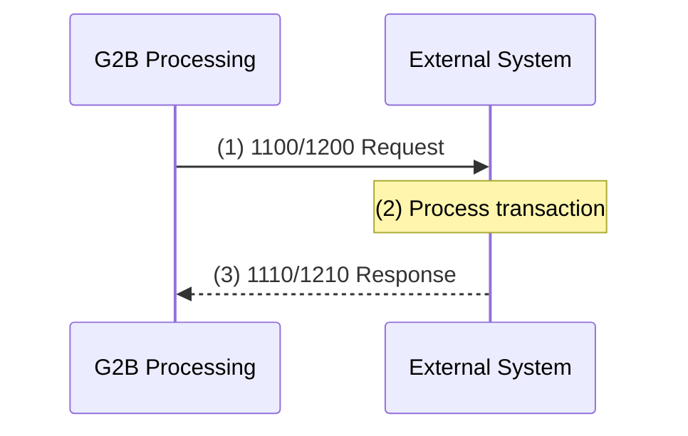

1. G2B Processing sends a **1100** (auth) or **1200** (financial) request to the External System.
2. The External System processes the transaction.
3. The External System responds with **1110**/ **1210** — either approving or denying the transaction.

---

### 12.5 Reversal Flow (G2B → External)

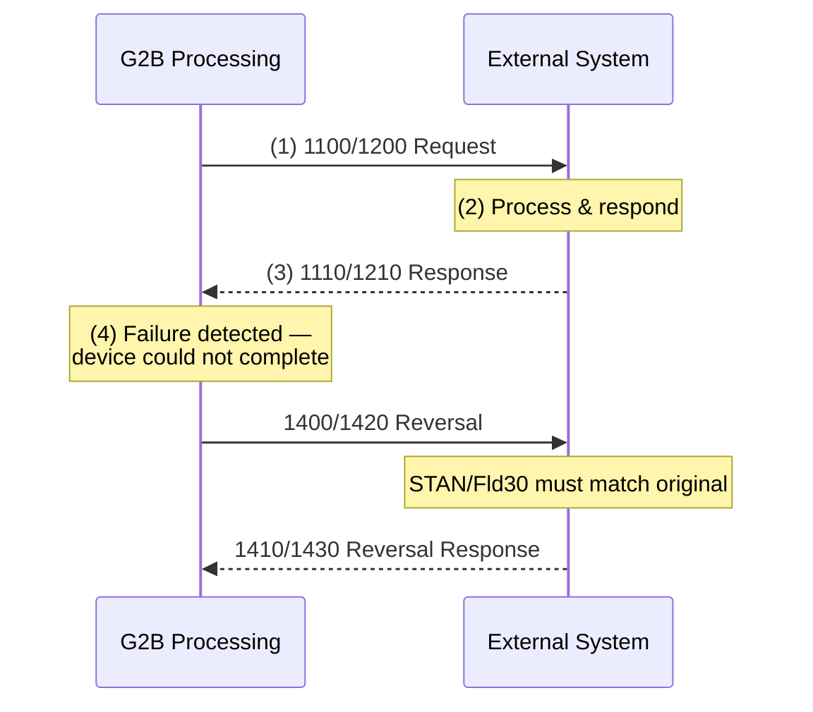

1. G2B sends **1100**/**1200** to External System.
2. External System processes and responds with **1110**/**1210**.
3. G2B detects the transaction failed to complete as authorised.
4. G2B sends a **1400**/**1420** reversal via guaranteed delivery.
5. External System acknowledges with **1410**/**1430**.

> **Key reversal rules:**
> - Field 4 ≤ Field 30 (partial reversal if Fld4 < Fld30)
> - Field 3 must match the original transaction
> - Fields 32 & 37 must match the original; Fields 11 & 12 may differ (original values go in Field 56)
> - Reversals persist until a response is received (SAF)

---

### 12.6 Timeout & Reversal Flow (G2B → External)

```mermaid
sequenceDiagram
    participant G2B as G2B Processing
    participant EXT as External System

    G2B->>EXT: (1) 1100/1200 Request
    Note over G2B: Timer set (35s)
    Note over G2B: (2) Timer expires —
    no response received
    G2B->>EXT: (3) 1420 Reversal (SAF)
    EXT-->>G2B: (4) 1430 Reversal Response
    EXT-->>G2B: (5) 1110/1210 (late)
    Note over G2B: Discard — too late
```

1. G2B sends request and starts a 35‑second timer.
2. Timer expires before any response arrives.
3. G2B creates a **1420** reversal and sends it via store‑and‑forward.
4. External System responds with **1430**.
   - If approved (Fld39=`400`): G2B deletes the reversal from the SAF queue.
   - If denied: G2B re‑sends as **1421** (Reversal Advice Repeat) up to the configured limit.
5. Any late **1110**/**1210** arriving after the timeout is **discarded**.

---

### 12.7 Request Flow (External → G2B)

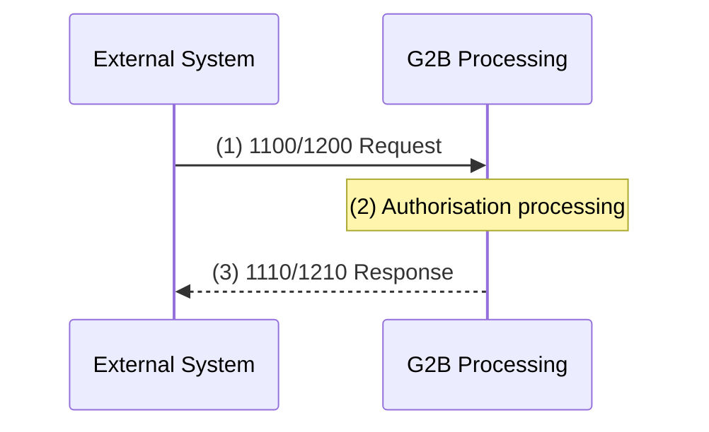

1. External System sends **1100**/**1200** to G2B Processing.
2. G2B processes and authorises.
3. G2B responds with **1110**/**1210**.

---

### 12.8 Reversal Flow (External → G2B)

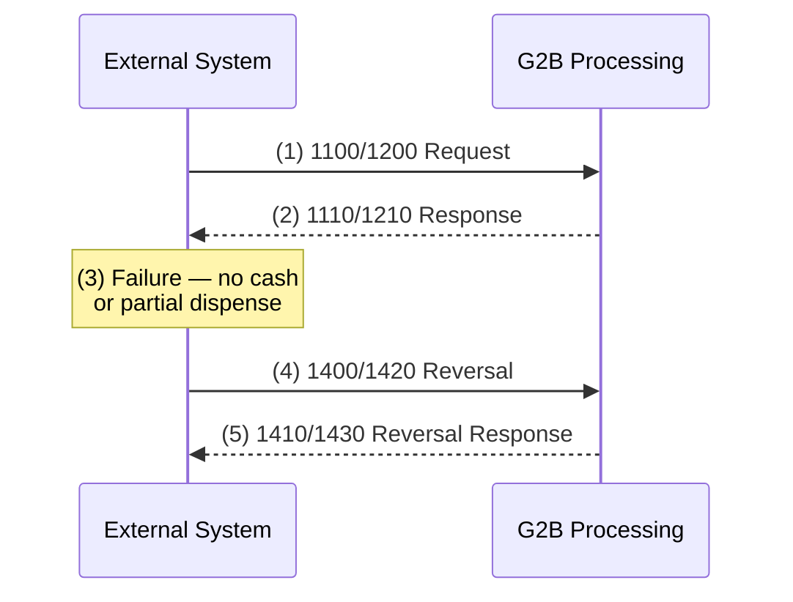

1. External System sends request; G2B approves.
2. ATM/POS fails — no cash dispensed, or only partial.
3. External System returns a **1400**/**1420** reversal.
4. G2B acknowledges with **1410**/**1430**.

---

### 12.9 Timeout Flow (External → G2B)

```mermaid
sequenceDiagram
    participant EXT as External System
    participant G2B as G2B Processing

    EXT->>G2B: (1) 1100/1200 Request
    Note over EXT: Timer set
    G2B-->>EXT: (2) 1110/1210 Response
    Note over EXT: (3) Timer expired —
    response arrived too late
    EXT->>G2B: (4) 1420 Reversal<br/>(Reason=4021)
    G2B-->>EXT: (5) 1430 Reversal Response
    Note over EXT: Discard late 1110/1210
```

1. External System sends request and sets a timer.
2. G2B processes but the response arrives after the External System's timer expires.
3. External System generates a **1420** with **Reason Code 4021** (Timeout Waiting For Response).
4. G2B acknowledges with **1430**.
5. If G2B denies the reversal, External System re‑sends as **1421** periodically (~1 min, up to 3 attempts). If still unresolved → manual investigation.

---

### 12.10 Network Management — Logon

#### G2B-Initiated Logon

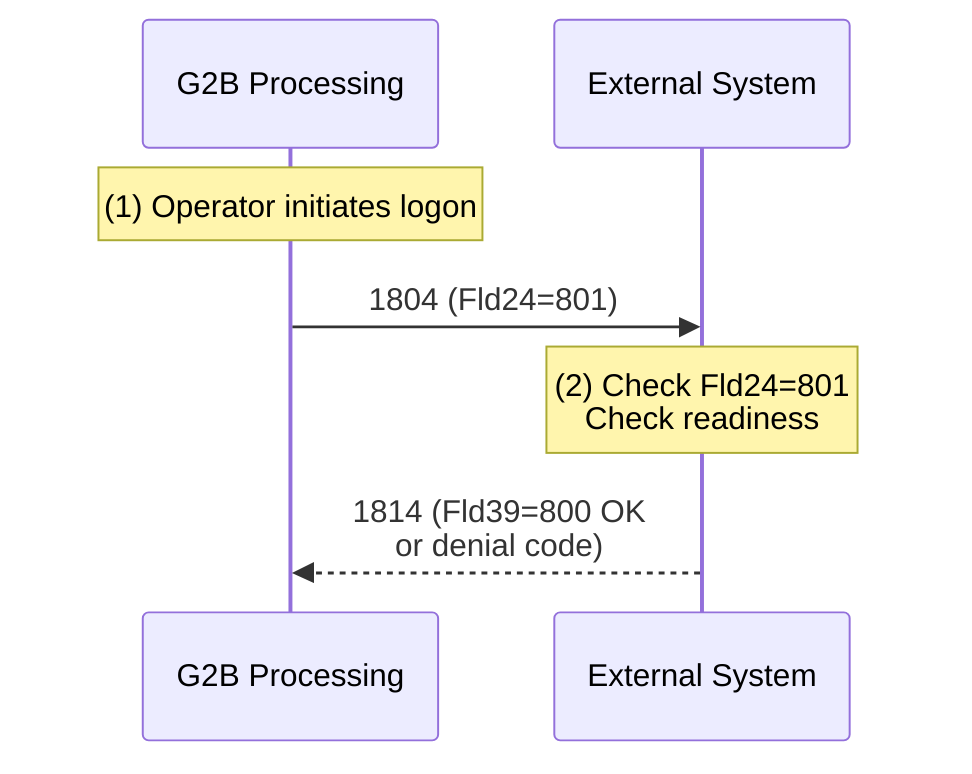

#### Bank-Initiated Logon

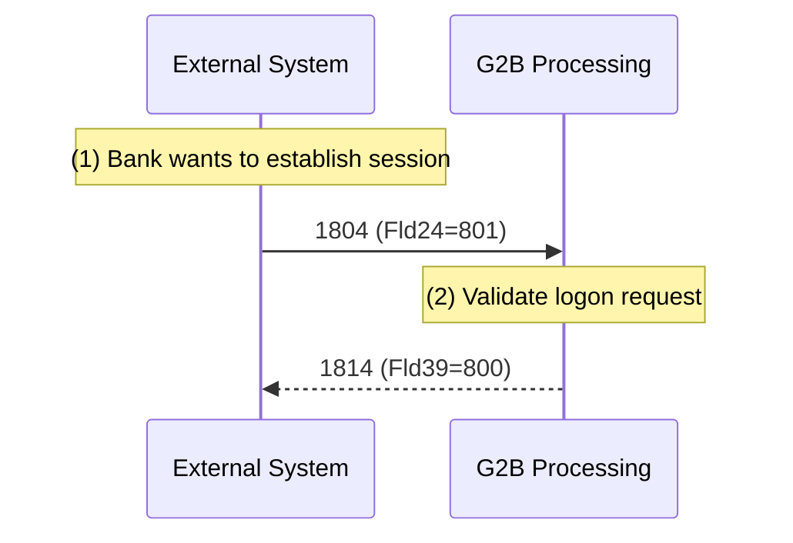

---

### 12.11 Network Management — Logoff

#### G2B-Initiated Logoff

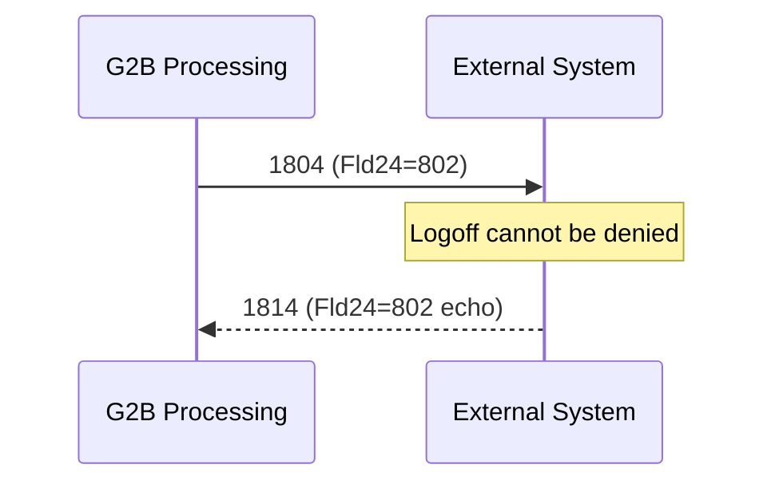

#### Bank-Initiated Logoff

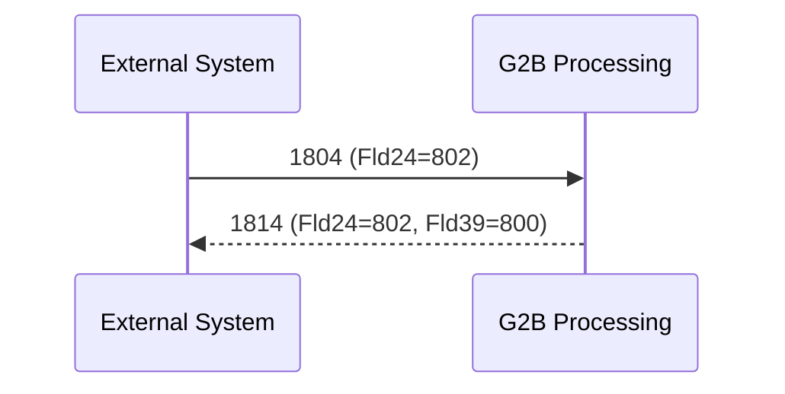

---

### 12.12 Network Management — Echo Test

#### G2B-Initiated Echo Test (Heartbeat)

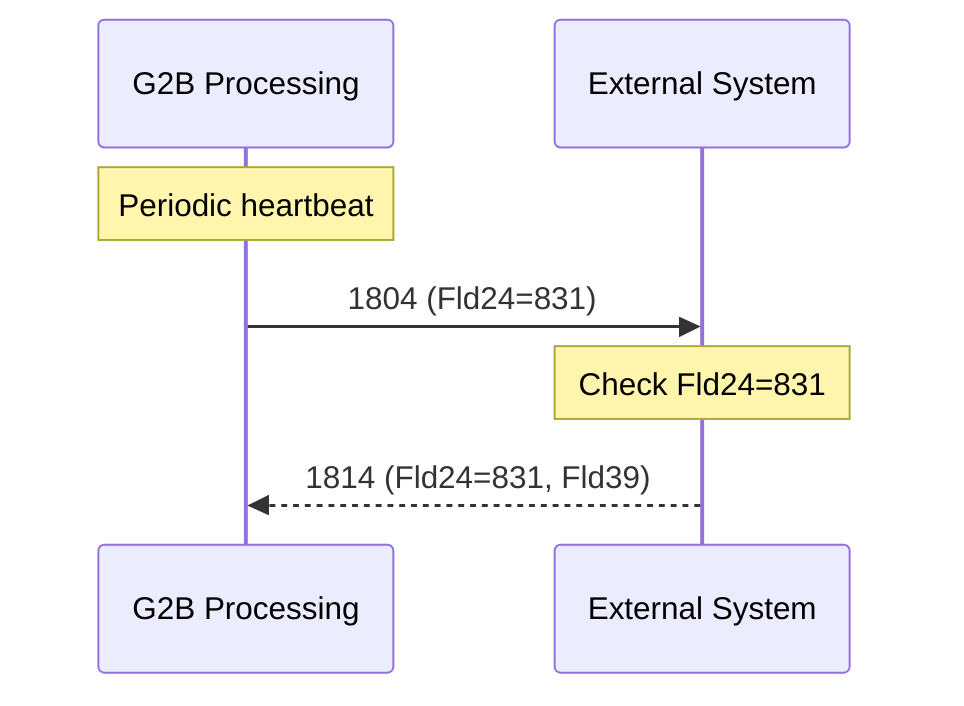

#### Bank-Initiated Echo Test

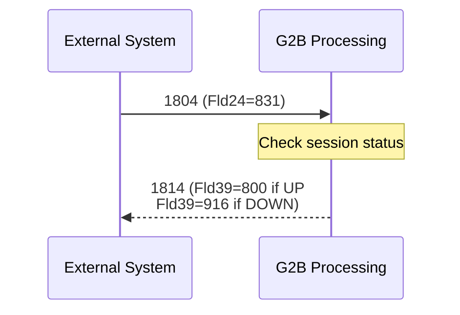

---

### 12.13 Network Management — Key Change

#### ZPK Change (G2B-Initiated)

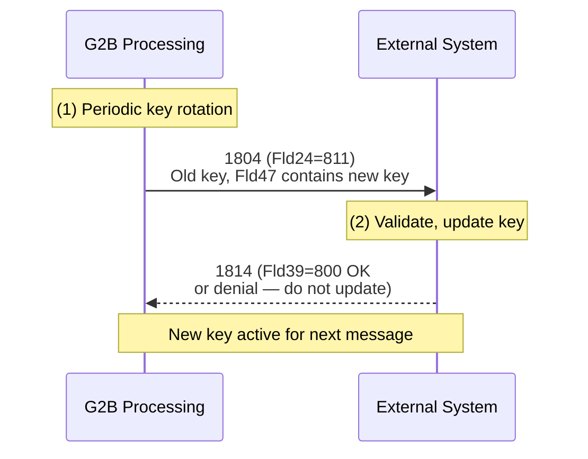

#### TPK Change (Terminal-Initiated)

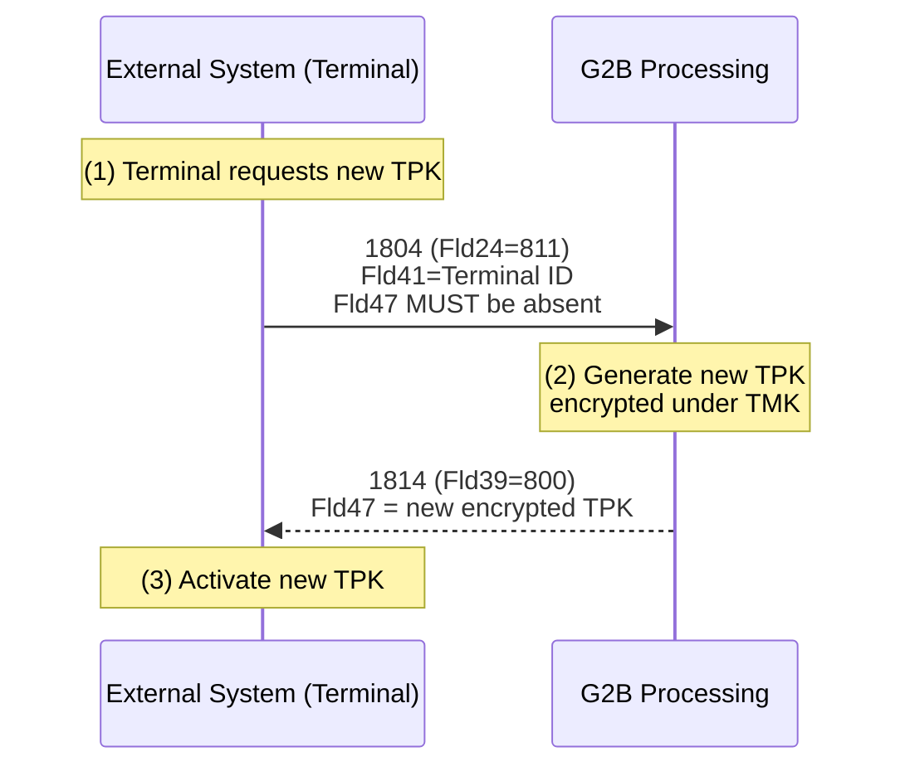

> ⚠️ **Warning:** If the External System fails to receive/process the TPK response, PIN‑based transactions will be rejected. A manual intervention or another successful TPK key change is required to recover.

---

### 12.14 Installment Payment Flow (Mastercard)

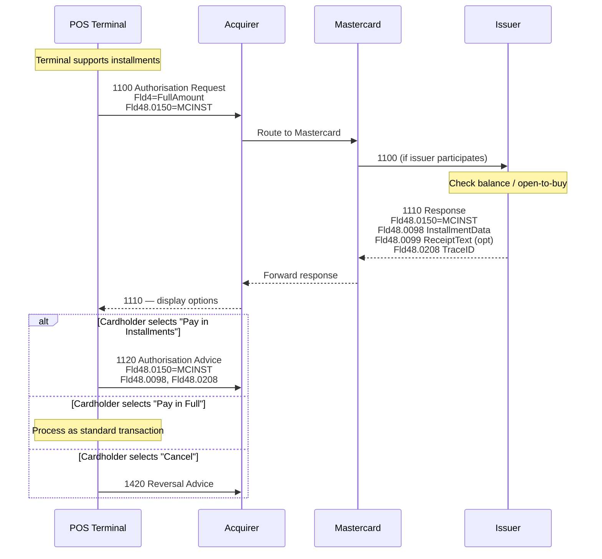

1. Terminal sends **1100** with full amount + `Fld48.0150=MCINST`.
2. Mastercard checks issuer participation in installments.
3. Issuer approves/declines full amount, returns **1110** with installment options in `Fld48.0098`.
4. Terminal displays options.
5. Cardholder chooses: **Installments** → **1120** advice, **Full** → standard flow, **Cancel** → **1420** reversal.

---

### 12.15 Preauthorisation Flow

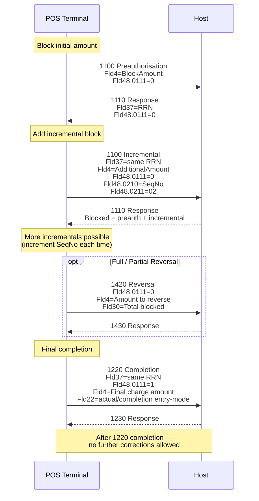

The preauthorisation lifecycle uses 4 message types:

| Step | MTI | Description | Key Fields |
|------|-----|-------------|------------|
| 1 | **1100** → **1110** | Initial preauthorisation (block funds) | `Fld48.0111=0` |
| 2 | **1100** → **1110** | Incremental authorisation | `Fld37`=RRN, `Fld48.0210`=SeqNo, `Fld48.0211=02` |
| 3 | **1420** → **1430** | Full/partial reversal (optional) | `Fld30`=total blocked so far |
| 4 | **1220** → **1230** | Completion (final charge) | `Fld48.0111=1`, `Fld37`=RRN |

> ⚠️ After the **1220** completion message, **no further corrections** (reversals, incremental auths) are permitted.

---

### 12.16 Money Transfer Flow

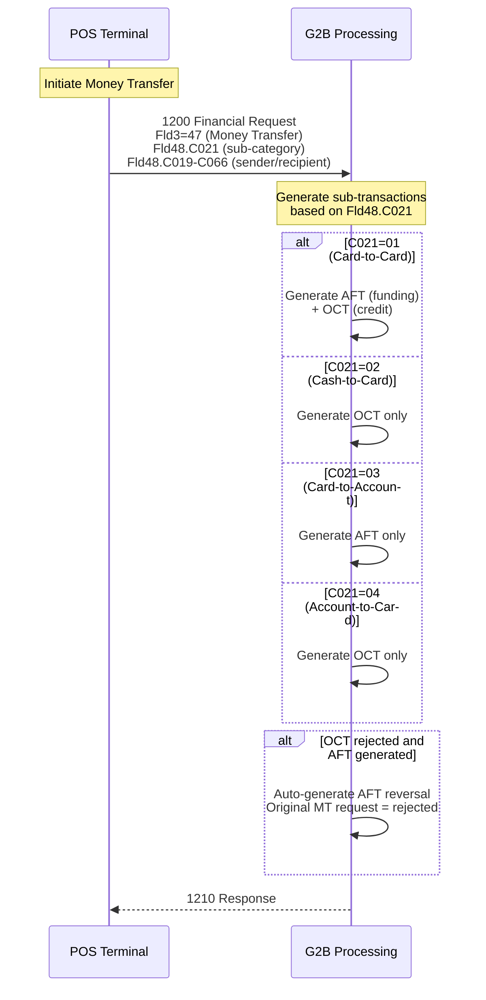

**Money Transfer sub‑category codes (`Fld48.C021`):**

| C021 | Type | Generated Transactions | Notes |
|------|------|----------------------|-------|
| `01` | Card‑to‑Card | AFT + OCT | Funding from sender card, credit to recipient card |
| `02` | Cash‑to‑Card | OCT only | Field 2 = dummy 16 zeroes |
| `03` | Card‑to‑Account | AFT only | Funding from sender card |
| `04` | Account‑to‑Card | OCT only | Field 2 = dummy 16 zeroes |

**MCC mapping for Money Transfer:**

| Network | Transaction Type | MCC |
|---------|-----------------|-----|
| Mastercard MoneySend | Funding | `6538` |
| Mastercard MoneySend | Payment (intracountry) | `6536` |
| Mastercard MoneySend | Payment (intercountry) | `6537` |
| VISA AFT/OCT | If Fld26 ∈ {4829,6012,6051,6211} | Use Fld26 value |
| VISA AFT/OCT | Otherwise | `6012` |

**Amount logic for Money Transfer:**
- **DR amount** = Field 4 (includes Acquirer Fee)
- **CR amount** = Field 4 − Field 46 (excludes Acquirer Fee)
- AFT carries RecRecipient information
- OCT uses Recipient PAN as Field 2 (transaction PAN), includes Sender Reference Number, Name, City, Country

---

### 12.17 Advice Message Processing (Store & Forward)

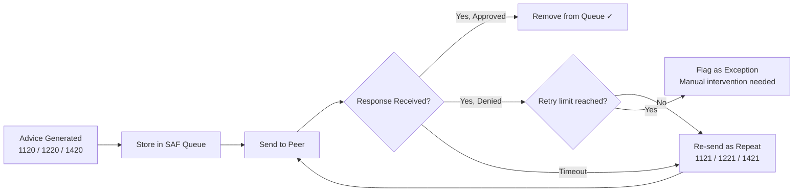

All advice messages use store‑and‑forward (SAF) for guaranteed delivery:
- **1120** — Authorisation Advice
- **1220** — Financial Advice  
- **1420** — Reversal Advice

If denied, they are re‑sent as repeat messages (**1121**/**1221**/**1421**) up to a configured limit.

> **Note:** There are no online reversals for advice messages. To cancel/change a **1220** advice, use a **return** transaction (`Fld3[1-2] = 20`).

