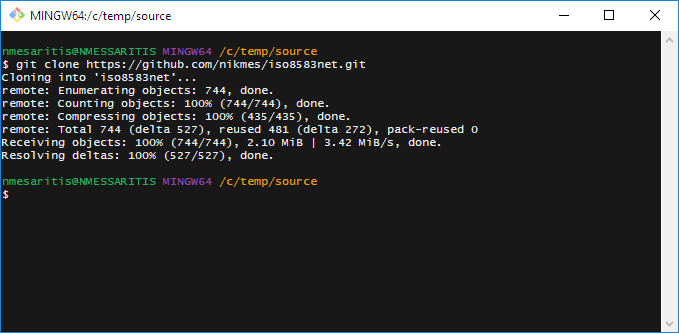
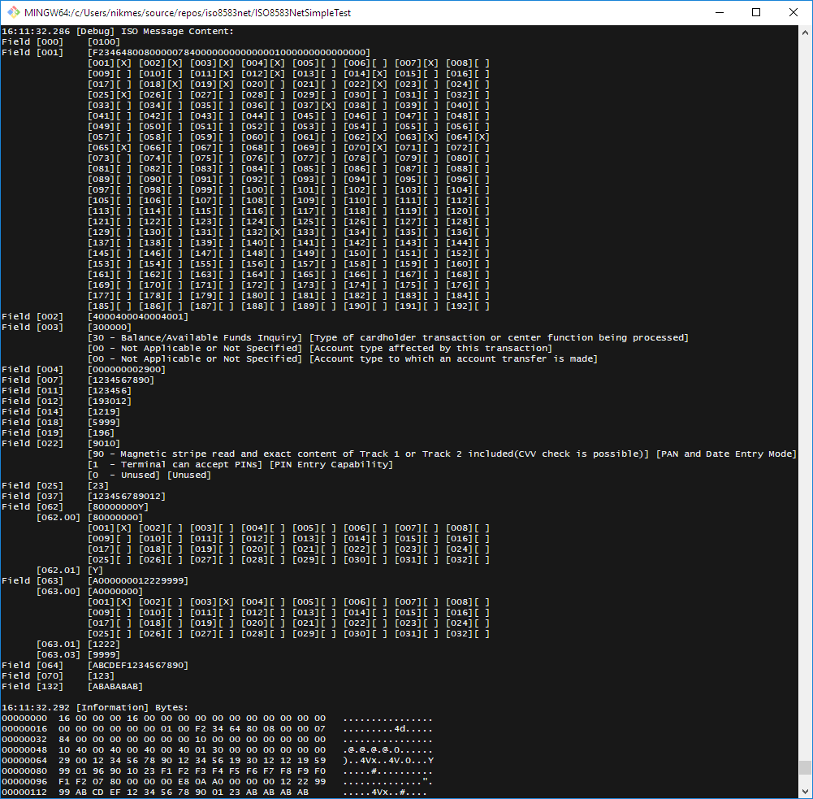

# Getting Started with ISO8583Net Library

### ISO8583Net

## Get it
Clone the repository using git.

### Windows
``` bash
$ git clone https://github.com/nikmes/iso8583net.git 
```


## Build it 
``` bash
$ cd iso8583net
$ dotnet build
```

## Run the simple sample
``` bash
$ cd ISO8583NetSimpleTest
$ dotnet run
```
You should see something like below


