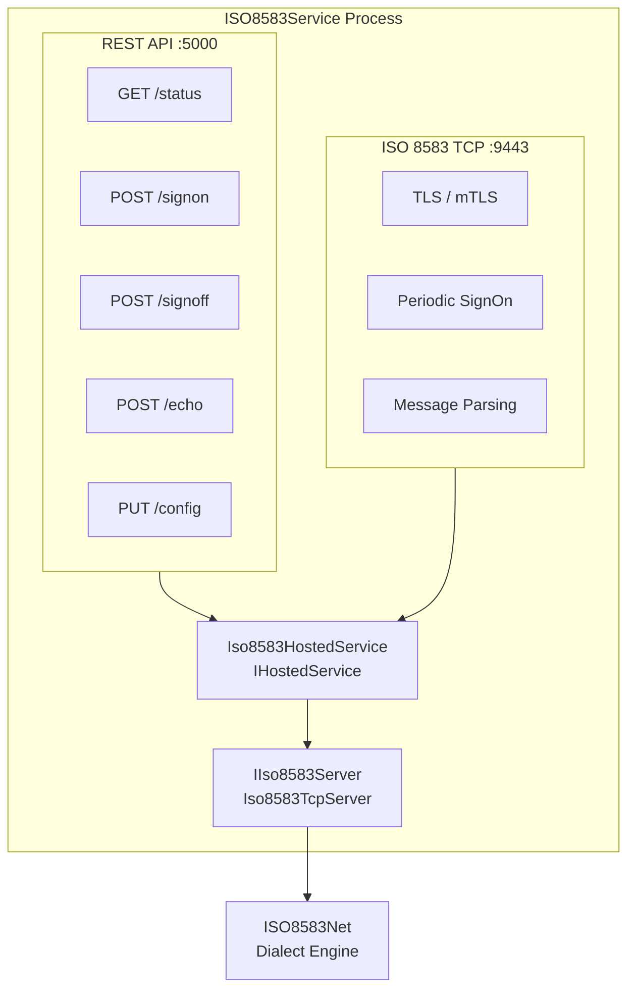
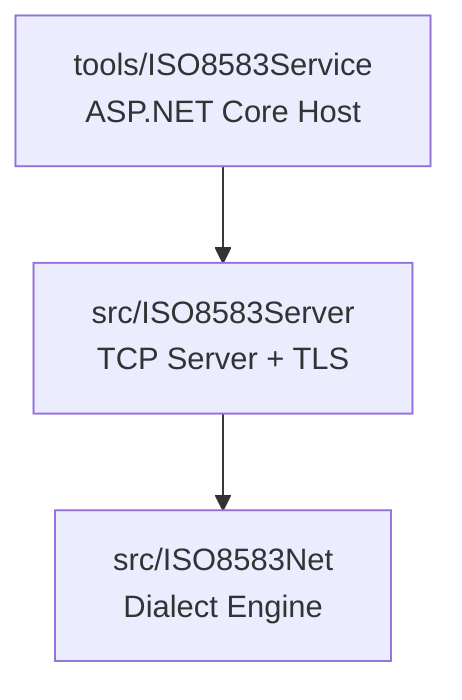

# ISO8583Service

ASP.NET Core hosted service that runs an **ISO 8583 TCP server** alongside a **REST management API** — a single process for both financial message handling and operational control.

## Architecture



The REST API and TCP server share the same `IIso8583Server` instance — API calls directly control the running server.

## Quick Start

```bash
cd tools/ISO8583Service
dotnet run
```

- **REST API:** http://localhost:5000
- **Scalar API Docs:** http://localhost:5000/scalar/v1
- **OpenAPI Spec:** http://localhost:5000/openapi/v1.json
- **ISO 8583 TCP:** port 9443 (configurable)

## Configuration

All settings in `appsettings.json`:

### HTTP Endpoint

```json
{
  "Kestrel": {
    "Endpoints": {
      "Http": {
        "Url": "http://0.0.0.0:5000"
      }
    }
  }
}
```

### ISO 8583 Server

```json
{
  "Iso8583Server": {
    "Port": 9443,
    "DialectPath": "Dialects/d8-iso8583.json",
    "SignOnIntervalSeconds": 30,
    "SendSignOnOnConnect": true,
    "EnablePeriodicSignOn": true,
    "TlsEnabled": true,
    "TlsCertPath": "/etc/d8dh/certs/server.crt",
    "TlsKeyPath": "/etc/d8dh/certs/server.key",
    "TlsCaCertPath": "/etc/d8dh/certs/ca.pem",
    "TlsRequireClientCert": true
  }
}
```

| Setting | Default | Description |
|---------|---------|-------------|
| `Port` | `9090` | TCP port for ISO 8583 connections |
| `DialectPath` | `null` | Path to dialect JSON. `null` = embedded VISA dialect. Set to `"Dialects/d8-iso8583.json"` for D8 G2B |
| `SignOnIntervalSeconds` | `0` | Interval between periodic SignOns. `0` = disabled |
| `SendSignOnOnConnect` | `false` | Send SignOn immediately when client connects |
| `EnablePeriodicSignOn` | `false` | Enable periodic SignOn loop |
| `TlsEnabled` | `false` | Enable TLS encryption |
| `TlsCertPath` | — | Path to server certificate (`.crt`) |
| `TlsKeyPath` | — | Path to server private key (`.key`) |
| `TlsCaCertPath` | — | Path to CA certificate for client verification |
| `TlsRequireClientCert` | `false` | Require mTLS — clients must present valid cert |

### Logging

Configured via Serilog, with console and rolling file sinks:

```json
{
  "Serilog": {
    "MinimumLevel": "Information",
    "WriteTo": [
      { "Name": "Console" },
      {
        "Name": "File",
        "Args": {
          "path": "logs/iso8583-service-.log",
          "rollingInterval": "Day",
          "retainedFileCountLimit": 7
        }
      }
    ]
  }
}
```

## REST API

Base URL: `http://localhost:5000/api/iso8583`

| Method | Endpoint | Description |
|--------|----------|-------------|
| `GET` | `/status` | Server status, connected clients, current config |
| `POST` | `/signon` | Send SignOn (MTI 1800, F24=801) to all clients |
| `POST` | `/signoff?disconnect=true` | Send SignOff (MTI 1800, F24=803). `disconnect=true` stops the server |
| `POST` | `/echo` | Send Echo (MTI 1800, F24=831) to all clients |
| `PUT` | `/config` | Update `SignOnIntervalSeconds` and `EnablePeriodicSignOn` at runtime |

### Example Responses

**`GET /api/iso8583/status`**
```json
{
  "isRunning": true,
  "connectionCount": 3,
  "connectedClients": [
    {
      "connectionNumber": 1,
      "remoteEndpoint": "10.1.2.3:55421",
      "connectedAt": "2026-07-17T06:00:00.0000000Z"
    }
  ],
  "config": {
    "port": 9443,
    "dialectPath": "Dialects/d8-iso8583.json",
    "signOnIntervalSeconds": 30,
    "sendSignOnOnConnect": true,
    "enablePeriodicSignOn": true,
    "tlsEnabled": true
  }
}
```

**`POST /api/iso8583/signon`**
```json
{
  "message": "SignOn request sent to 3 client(s).",
  "clientsNotified": 3
}
```

**`PUT /api/iso8583/config`**
```json
// Request body
{
  "signOnIntervalSeconds": 60,
  "enablePeriodicSignOn": true
}

// Response
{
  "message": "Configuration updated.",
  "signOnIntervalSeconds": 60,
  "enablePeriodicSignOn": true
}
```

## Publishing & Deployment

### Publish (Linux x64)

```bash
dotnet publish tools/ISO8583Service/ISO8583Service.csproj \
  --configuration Release \
  --runtime linux-x64 \
  --self-contained true \
  --output publish/
```

### Deploy with systemd

```bash
# Copy service unit
sudo cp deploy/iso8583service.service /etc/systemd/system/

# Edit paths in the unit file, then:
sudo systemctl daemon-reload
sudo systemctl enable iso8583service
sudo systemctl start iso8583service
```

### Files bundled in publish output

| File | Source | Purpose |
|------|--------|---------|
| `appsettings.json` | Project root | Runtime configuration |
| `Dialects/*.json` | `src/ISO8583Net/ISODialects/` | Dialect definitions |
| `deploy/deploy.sh` | `deploy/` | Deployment script (Linux) |
| `deploy/iso8583service.service` | `deploy/` | systemd unit file |

## Dialects

Choose the dialect via `Iso8583Server.DialectPath` in `appsettings.json`:

| Value | Effect |
|-------|--------|
| `null` or `""` | Embedded VISA BASE I dialect (default) |
| `"Dialects/d8-iso8583.json"` | D8 G2B ISO 8583:1993 |
| `"path/to/custom.json"` | Any custom dialect file |

Dialect JSON files are copied to `Dialects/` in the publish output automatically via the `.csproj` configuration.

## Project References



## Key Classes

| Class | Role |
|-------|------|
| `Program` | Application entry point, DI setup, pipeline configuration |
| `Iso8583HostedService` | `IHostedService` wrapper — starts/stops the TCP server with the app lifetime |
| `Iso8583Controller` | REST API controller — exposes management endpoints |
| `ServerOptions` | Strongly-typed config binding for `Iso8583Server` section |
| `ConfigUpdate` | DTO for `PUT /config` runtime updates |

## Health Checks

The service exposes a health endpoint at `GET /health`:

```json
{
  "status": "Healthy",
  "description": "All systems operational",
  "data": {
    "ConnectionCount": 3,
    "IsRunning": true,
    "HandlerCount": 5,
    "TotalMessagesReceived": 15000,
    "TotalMessagesSent": 15000,
    "TotalParseErrors": 0,
    "MaxWriteQueueLength": 4,
    "MaxInFlight": 12
  }
}
```

| Status | Trigger |
|--------|---------|
| `Healthy` | Server running, no backpressure |
| `Degraded` | No connections OR write queue > 200 |
| `Unhealthy` | Server not running |

## Custom Message Handlers

Register handlers in `Program.cs` via DI. Each handler declares which MTIs it processes.

### Handler Example: Authorization

```csharp
using ISO8583Net.Message;
using ISO8583Net.Server.Pipeline.Handlers;
using ISO8583Net.Server.Pipeline.Messages;

public sealed class AuthorizationHandler : IMessageHandler
{
    public IReadOnlySet<string> SupportedMTIs { get; } =
        new HashSet<string> { "0100", "0120" };

    public async Task<ISOMessage?> HandleAsync(MessageContext context, CancellationToken ct)
    {
        var request = context.Request;
        string pan = request.GetFieldValue(2) ?? "";
        string amount = request.GetFieldValue(4) ?? "";

        // ... business logic ...

        var response = context.Request; // copy fields from request
        response.Set(0, "0110");        // set response MTI
        response.Set(39, "00");         // approval
        return response;
    }
}
```

### Register in Program.cs

```csharp
// Replace or add to the default handler:
builder.Services.AddSingleton<IMessageHandler, AuthorizationHandler>();
builder.Services.AddSingleton<IMessageHandler, FinancialHandler>();
builder.Services.AddSingleton<IMessageHandler, DefaultHandler>(); // catch-all
```

Handlers are dispatched in parallel for the same MTI. Catch-all handlers (MTI `"*"`) receive every message.

## Pipeline Tuning

Based on BenchmarkDotNet measurements (Sprint 5):

| Setting | Recommended | Rationale |
|---------|-------------|-----------|
| `ParserConcurrency` | **2** | 25% speedup vs 1; no gain at 4+ |
| `RawMessageCapacity` | **256** | Sufficient for 470K msg/sec throughput |
| `ParsedMessageCapacity` | **512** | Twice raw capacity — parsed msgs are smaller |
| `OutboundMessageCapacity` | **256** | Matches raw; backpressure via `Wait` mode |
| `DrainTimeoutSeconds` | **30** | Default; reduce for fast shutdown requirements |
| `MaxParseErrorsBeforePause` | **10** | Circuit breaker: pause reader after 10 consecutive parse errors |
| `ParserCooldownSeconds` | **5** | Cooldown period before reader resumes |

### Measured Performance (Pipeline SEDA)

| Metric | Value |
|--------|-------|
| Single message round-trip (P50) | **19.9 µs** |
| Throughput (single connection) | **470K msg/sec** |
| Per-message processing | **~2–3 µs** |
| Memory per round-trip | **~17 KB** |
| P99 (1K batch) | **~3.0 µs/msg** |
| P99 (5K batch) | **~6.0 µs/msg** |

### Parser Concurrency Scaling

| Tasks | 500 msgs | vs 1-task |
|-------|----------|-----------|
| 1 | 1.33 ms | baseline |
| 2 | **1.00 ms** | **25% faster** |
| 4 | 1.01 ms | no gain |
| 8 | 1.00 ms | no gain |

**Recommendation:** Set `ParserConcurrency` to 2. Additional tasks add GC pressure without throughput gain.
