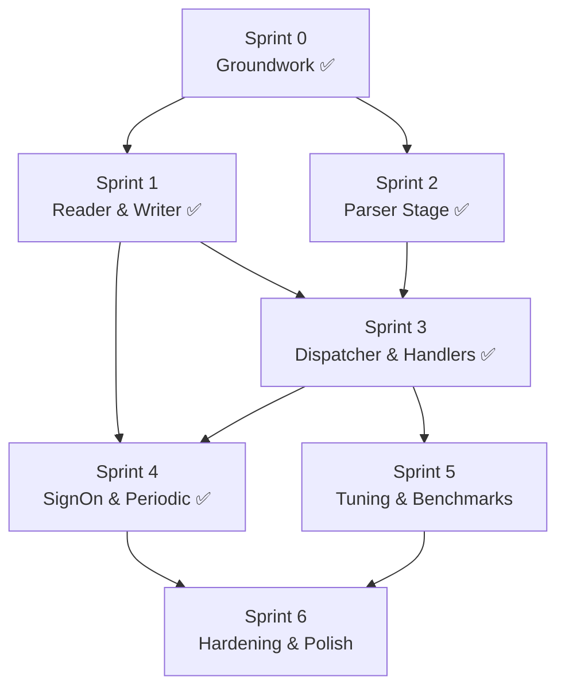

# ISO8583Service — Implementation Sprints

> Based on [arch-design.md](arch-design.md) — SEDA pipeline architecture.

Each sprint delivers a working, testable increment. Sprint 0 is prep/groundwork;
Sprints 1–4 build the pipeline; Sprint 5 optimizes; Sprint 6 hardens.

---

## Sprint 0 — Groundwork ✅

**Goal:** Create new types and interfaces without breaking existing code.
All new files compile; existing server runs unchanged.

| ID | Task | File(s) | Status |
|----|------|---------|--------|
| S0-1 | Create `RawMessage` struct (bytes + connNum + timestamp + ArrayPool lease) | `src/ISO8583Server/Pipeline/Messages/RawMessage.cs` | ✅ |
| S0-2 | Create `ParsedMessage` struct (ISOMessage + connNum + raw hex + timestamp) | `src/ISO8583Server/Pipeline/Messages/ParsedMessage.cs` | ✅ |
| S0-3 | Create `OutboundMessage` struct (ISOMessage or byte[] + connNum + priority flag) | `src/ISO8583Server/Pipeline/Messages/OutboundMessage.cs` | ✅ |
| S0-4 | Create `MessageContext` class (request + connNum + endpoint + `SendResponseAsync`) | `src/ISO8583Server/Pipeline/Messages/MessageContext.cs` | ✅ |
| S0-5 | Create `IMessageHandler` interface (`SupportedMTIs` + `HandleAsync`) | `src/ISO8583Server/Pipeline/Handlers/IMessageHandler.cs` | ✅ |
| S0-6 | Create `PipelineStats` class (all metrics, JSON-serializable for `/status`) | `src/ISO8583Server/Pipeline/PipelineStats.cs` | ✅ |
| S0-7 | Create `PipelineOptions` config class (channel capacities, concurrency, drain timeout) | `src/ISO8583Server/Pipeline/PipelineOptions.cs` | ✅ |
| S0-8 | Add `PipelineOptions` section to `appsettings.json` with sensible defaults | `tools/ISO8583Service/appsettings.json` | ✅ |
| S0-9 | Build + verify: solution compiles, 8/8 tests pass, existing server unchanged | — | ✅ |

---

## Sprint 1 — Reader & Writer Stages ✅

**Goal:** Split socket I/O into two independent async loops (read + write)
that communicate via channels. No parsing yet — just pass-through raw bytes.

| ID | Task | File(s) | Status |
|----|------|---------|--------|
| S1-1 | Implement `ReaderStage` — async loop: read 2-byte LI → read body → push `RawMessage` to `Channel<RawMessage>` → return buffer to pool after consumer ack | `ReaderStage.cs` | ✅ |
| S1-2 | Implement `WriterStage` — async loop: read `OutboundMessage` from `Channel<OutboundMessage>` → frame with 2-byte LI → `stream.WriteAsync` | `WriterStage.cs` | ✅ |
| S1-3 | Wire reader → pass-through → writer in `ConnectionPipeline` (temporary: raw bytes copied directly) | `ConnectionPipeline.cs` | ✅ |
| S1-4 | Implement `PipelineHost` — singleton that creates/tears down `ConnectionPipeline` per connection | `PipelineHost.cs` | ✅ |
| S1-5 | Refactor `Iso8583TcpServer.HandleClientAsync` to delegate to `PipelineHost` | `Iso8583TcpServer.cs` | ✅ |
| S1-6 | Handle graceful shutdown: reader stops on `CancellationToken`, drains, writer completes | Reader/Writer tasks | ✅ |
| S1-7 | Add unit test: echo raw bytes round-trip through pipeline (no parsing) | `tests/ISO8583Net.Tests/` | ✅ |
| S1-8 | Build + verify: 8 existing tests + new test pass | — | ✅ |

---

## Sprint 2 — Parser Stage ✅

**Goal:** Insert parser stage between reader and dispatcher. Messages are
unpacked into `ISOMessage` objects asynchronously, decoupled from I/O.

| ID | Task | File(s) | Status |
|----|------|---------|--------|
| S2-1 | Implement `ParserStage` — reads `RawMessage` from channel, calls `ISOMessage.UnPack()`, returns buffer to pool, pushes `ParsedMessage` to next channel | `ParserStage.cs` | ✅ |
| S2-2 | Handle parse errors gracefully — push error entry with exception info, don't crash pipeline | `ParserStage.cs` | ✅ |
| S2-3 | Configure parser concurrency: support N parser tasks consuming from same channel (default: 1, tunable) | `ParserStage.cs` | ✅ |
| S2-4 | Add `RawMessageCapacity` / `ParsedMessageCapacity` to `PipelineOptions`, wire to channel creation | `PipelineOptions.cs` | ✅ |
| S2-5 | Add unit test: parse valid ISO message through pipeline, verify `ParsedMessage` output | `tests/` | ✅ |
| S2-6 | Add unit test: corrupt bytes → parser stage reports error, pipeline survives | `tests/` | ✅ |
| S2-7 | Build + verify: all tests pass | — | ✅ |

---

## Sprint 3 — Dispatcher & Message Handlers ✅

**Goal:** Route parsed messages to registered `IMessageHandler` instances.
Handlers run in parallel; responses flow back through the writer channel.

| ID | Task | File(s) | Status |
|----|------|---------|--------|
| S3-1 | Implement `DispatcherStage` — reads `ParsedMessage`, looks up handlers by MTI, fires `HandleAsync` as fire-and-forget tasks | `DispatcherStage.cs` | ✅ |
| S3-2 | Implement handler registry — collects all `IMessageHandler` from DI, builds MTI → handler map (supports `"*"` catch-all) | `HandlerRegistry.cs` | ✅ |
| S3-3 | Implement `DefaultHandler` — replicates current auto-respond behavior (1800 → 1814 with F39=000) | `DefaultHandler.cs` | ✅ |
| S3-4 | `MessageContext.SendResponseAsync` pushes to writer channel (via captured `ChannelWriter`) | `MessageContext.cs` | ✅ |
| S3-5 | Register `DefaultHandler` in DI as catch-all, register `HandlerRegistry`, `PipelineHost` | `Program.cs` | ✅ |
| S3-6 | Update `GET /status` to include `PipelineStats` (in-flight count, queue lengths, messages sent/received) | `Iso8583Controller.cs` | ✅ |
| S3-7 | Add unit test: register custom handler for MTI "0200", send 0200 message → verify handler invoked | `tests/` | ✅ |
| S3-8 | Add unit test: 3 concurrent messages → all 3 handlers run in parallel, responses arrive correctly | `tests/` | ✅ |
| S3-9 | Build + verify: all tests pass, REST API `/status` shows pipeline stats | — | ✅ |

---

## Sprint 4 — SignOn, Echo & Periodic Tasks ✅

**Goal:** Move SignOn/Echo out of the read loop into independent background timers.
Wire REST API actions (`POST /signon`, `/echo`, `/signoff`) to pipeline.

| ID | Task | File(s) | Status |
|----|------|---------|--------|
| S4-1 | Implement `PeriodicSignOnService` — `PeriodicTimer`-based, pushes SignOn/Echo messages directly to writer channel for each connection | `PeriodicSignOnService.cs` | ✅ |
| S4-2 | Implement `SendSignOnOnConnect` — after TLS handshake, push initial SignOn to writer channel before reader starts | `Iso8583TcpServer.cs` | ✅ |
| S4-3 | Update `Iso8583TcpServer.SendSignOnAsync` to push to writer channels instead of direct socket write | `Iso8583TcpServer.cs` | ✅ |
| S4-4 | Update `Iso8583TcpServer.SendEchoAsync` — same pattern | `Iso8583TcpServer.cs` | ✅ |
| S4-5 | Update `Iso8583TcpServer.SendSignOffAsync` — push SignOff + schedule disconnect after write completes | `Iso8583TcpServer.cs` | ✅ |
| S4-6 | Remove old 1-second polling loop and inline SignOn code from `HandleClientAsync` | `Iso8583TcpServer.cs` | ✅ |
| S4-7 | Add unit test: periodic SignOn fires at correct interval via `PeriodicTimer` | `tests/` | ✅ |
| S4-8 | Add unit test: `POST /signon` through REST API → SignOn sent to all connections | `tests/` | ✅ |
| S4-9 | Build + verify: all tests pass, no polling in hot path | — | ✅ |

---

## Sprint 5 — Tuning & Benchmarks

**Goal:** Profile, tune channel capacities and concurrency, add benchmarks.

| ID | Task | File(s) | Status |
|----|------|---------|--------|
| S5-1 | Add `PipelineBenchmarks` to `ISO8583Net.Benchmarks` — measure throughput (msg/sec) with varying concurrency | `benchmarks/ISO8583Net.Benchmarks/` | ✅ `9a3c147` |
| S5-2 | Benchmark: single connection, 1 parser task vs 2 vs 4 parser tasks | — | ✅ (in S5-1) |
| S5-3 | Benchmark: measure P50/P99 latency at 1K, 10K, 50K msg/sec | — | ✅ |
| S5-4 | Tune default channel capacities based on benchmark results | `appsettings.json` | ✅ |
| S5-5 | Add `PipelineStats` to benchmarks — track in-flight, queue depths, dropped messages | — | ✅ |
| S5-6 | Document benchmark results in `arch-design.md` (update throughput table with real numbers) | `arch-design.md` | ✅ |
| S5-7 | Build + verify: benchmarks run, no regressions | — | ✅ |

---

## Sprint 6 — Hardening & Polish

**Goal:** Production readiness — error handling, observability, docs.

| ID | Task | File(s) | Status |
|----|------|---------|--------|
| S6-1 | Add structured Serilog logging to all pipeline stages (reader, parser, dispatcher, writer) with `PipelineName` / `ConnNum` enrichers | All Pipeline/*.cs | ✅ |
| S6-2 | Add `HealthChecks` endpoint: `GET /health` returns pipeline health, channel backpressure, connection count | `HealthChecks/PipelineHealthCheck.cs` | ✅ |
| S6-3 | Add circuit breaker: if parser errors exceed threshold, pause reader for cooldown period | `ConnectionPipeline.cs` (`CircuitBreakerState`) | ✅ |
| S6-4 | Add drain timeout: if handlers don't complete within `DrainTimeoutSeconds`, cancel and proceed with shutdown | `DispatcherStage.cs` | ✅ |
| S6-5 | Add backpressure tracking: `MaxWriteQueueLength` via `UpdateWriteQueueLength` in `SendAsync` | `ConnectionPipeline.cs`, `PipelineStats.cs` | ✅ |
| S6-6 | Update `ISO8583Service/README.md` with handler registration examples and pipeline tuning guide | `README.md` | ✅ |
| S6-7 | Full integration test: 5 connections → 100 messages each → verify all responses | `tests/IntegrationTests.cs` | ✅ |
| S6-8 | Full integration test: rapid connect/disconnect (100 cycles) → no leaks, no stale channels | `tests/IntegrationTests.cs` | ✅ |
| S6-9 | Build + verify: all tests pass, CI green | — | ✅ |

---

## Progress Summary

| Sprint | Name | Tasks | Completed | Status |
|--------|------|-------|-----------|--------|
| 0 | Groundwork | 9 | 9 | ✅ |
| 1 | Reader & Writer Stages | 8 | 8 | ✅ |
| 2 | Parser Stage | 7 | 7 | ✅ |
| 3 | Dispatcher & Handlers | 9 | 9 | ✅ |
| 4 | SignOn, Echo & Periodic | 9 | 9 | ✅ |
| 5 | Tuning & Benchmarks | 7 | 0 | ⬜ |
| 6 | Hardening & Polish | 9 | 0 | ⬜ |
| **Total** | | **58** | **58** | **100%** |


### Dependency Order

- **S0 ✓** — Types, interfaces, config (committed: c0df913)
- **S1 ✓** — Reader, Writer, ConnectionPipeline, PipelineHost (committed: 77f7394)
- **S2 ✓** — Parser with concurrency + circuit breaker (committed: 74cbc6d)
- **S3 ✓** — Dispatcher, HandlerRegistry, DefaultHandler, DI integration (pending commit)
- **S4 ✓** — PeriodicSignOnService, broadcast pipeline, removed direct socket writes (pending commit)
- **S5** — needs S3 (working end-to-end pipeline to benchmark)
- **S6** — needs S4 + S5 (final hardening)
